# 1.数据库

地位：基础知识

测试：查

分类：关系型&非关系型

​			关系型：Mysql（必会）

​			非关系型：Redis（了解）


# 2.Mysql

可参考：https://www.runoob.com/mysql/mysql-tutorial.html

在门道：wampserver（windows，apache，Mysql，php），集成开发环境

客户端：navicat（主讲），sqlyog（课后）

连数据库需要的参数：ip、端口（默认3306）、用户名（root）、密码


## 2.1 建库&建表

在实际工作中，你不会涉及，但是作为数据库的知识体系，你还是要了解一下的


## 2.2 导入&导出

在门道我们讲图形界面操作


## **2.3 查询（重点）**

前提：上班后，你连上了公司的数据库服务器，应先熟悉你系统的对应的表和表中数据

这个记不住，你上班做测试很痛苦

当然，有的公司测试不需要看数据库，直接测就行


### 2.3.1 准备数据

**把对应的数据导入到数据库中，请熟悉2表和表数据，如果你记不住，你无法听课**，

以下内容举例都用这两个表

例：现在有两个表，dept和emp，分别有以下几个字段，每个字段都要有各自的内容

1. dept：部门表----department

   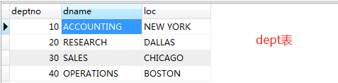

   deptno：部门编号

   dname：部门名称

   loc：部门位置----location

2. emp：雇员表----employee

   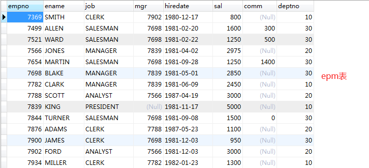

   empno：员工编号

   ename：员工姓名

   job：职位

   mgr：上级领导

   hiredate：入职日期

   sal：薪水----salary

   comm：奖金----commsion

   deptno：部门编号


### 2.3.2 简单查询

**在输入sql语句后，最好带个分号，避免语句重叠出错**


#### （1）完整语法（必记）

注意：select和from是必写，其他选写（根据需求），不能‘插队’

select **[distinct] 字段** **[分组函数]**

from **表**

[where **条件**]

[group by **字段**]

[having **条件**]：只能跟在group by后面

[order by **字段**]：asc---正序，一般不写；desc---降序


#### （2）select

1.查询一个字段

```mysql
# 分号结束
select ename from emp;
```

2.查询多个字段

```mysql
# 逗号分割字段
select ename,sal,comm,mgr from emp;
```

3.查询所有字段

```mysql
# *：表示所有字段
select * from emp;
```

4.运算

```mysql
# 运算：+-*/
select sal,sal*12 from emp;
select sal,comm,sal+comm,(sal+comm)*12 from emp;    # 运算列有空值,运算结果也是空

# 为了规避运算空这个现象,Mysql采用ifnull函数
select sal,comm,sal+ifnull(comm,0),(sal+ifnull(comm,0))*12 from emp;
```

5.别名：取名让人能懂--“见名知意”

```mysql
# 别名：alias----as，一般不用加，可直接空格
# 最好不写中文或拼音
select sal,comm,sal+ifnull(comm,0) as 月薪,(sal+ifnull(comm,0))*12 as 年薪 from emp;

# 如果你这样写,语法上来说没有错误,但你的同事会:) 

select sal,comm,sal+ifnull(comm,0) months_sal,(sal+ifnull(comm,0))*12 yeaer_sal from emp;
```

6.去重（去除重复）

```mysql
select distinct job from emp;

# 注意：说的是job和mgr同时相同的数据去重,即把两者同时一起看
select distinct job,mgr from emp;
```


#### （3）from

可以取个别名

好处：能够加快并且不出错的写字段，也规避了你记不住字段的尴尬

```mysql
select e.sal,e.comm,e.hiredate from emp e;    # 先取别名，在输字段
```


#### （4）where

where后跟条件condition，说的是找出符合条件的数据

1.数字

```mysql
# <,>,=,>=,<=,<> 
select * from emp where sal > 1500;

# between a and b
# [a,b],是个闭区间行为，既包含a，也包含b
select ename from emp where sal between 1500 and 3000;
```


2.字符串，凡用单引号引起来的都是字符串

```mysql
# 1.精确匹配：=
select * from emp where ename = 'SMITH';

# 2.模糊匹配------like
# _:匹配1个字符
# %:匹配0个或多个字符
# 其他案例(忘记吧:))：张%、__A___、__A___%、%__A___、%__A___%
select * from emp where ename like '%A%';
```

3.空值------is null

```mysql
select * from emp where comm is null;
```


4.一堆值------in（一列中的某些值）

```mysql
# in不会造成你sql的错误,无非就是找不到任何数据而已
select * from emp where ename in ('SCOTT','KING','smith','cai10');
```


5.取反------not

```mysql
in							not in
is null						is not null
like						not like
between ... and ...			not between ... and ...
```


练习：

1. 选择部门30中的雇员

   ```mysql
   select ename from emp where deptno = '30';
   ```

2. 列出所有办事员(CLERK)的姓名、编号和部门

   ```mysql
   select ename,empno,job from emp where job = 'CLERK';
   ```

3. 找出佣金高于薪金的员

   ```mysql
   select ename from emp where comm > sal;
   ```

4. 找出佣金高于薪金60%的雇员

   ```mysql
   select ename from emp where comm > sal*0.6;
   ```

5. 找出部门10中所有经理和部门20中的所有办事员的详细资料

   ```mysql
   select * from emp where (deptno = '10' and  job = 'MANAGER') or (deptno = '20' and job = 'CLERK');
   ```

6. 找出部门10中所有经理、部门20中所有办事员，既不是经理又不是办事员但其薪金 > =2000的所有雇员的详细资料

   ```mysql
   select * from emp where (deptno = '10' and  job = 'MANAGER') 
   or (deptno = '20' and job = 'CLERK') 
   or (deptno not in ('MANAGER','CLERK') and sal  > = 2000);
   ```

7. 找出收取佣金的雇员的不同工作

   ```mysql
   select distinct job from emp where comm is not null;
   ```

8. 找出不收取佣金或收取的佣金低于100的雇员

   ```mysql
   select ename from emp where comm is null or comm <=100;
   ```

   

#### （5）group by

1. 分组函数

   先学select上只有分组函数这一个字段

   常见的分组函数：avg、sum、max、min、count

   ```mysql
   # avg,sum类型必须是数,max,min,count不限制类型,count不统计null值
   
   select avg(sal) from emp; 
   select avg(ename) from emp;# 错误
   
   select sum(sal) from emp;
   select sum(ename) from emp;# 错误
   
   select max(hiredate) from emp;
   select min(ename) from emp;
   select count(ename) from emp;
   
   select count(comm) from emp;
   
   # 注意
   # 1.可以做运算
   select sum(sal+ifnull(comm,0)) from emp;
   
   # 2.不能带表达式
   select avg(sal > 1500) from emp;# 错误
   select avg(sal) from emp where sal > 1500;
   
   # 3.不能直接在where上使用组函数
   select * from emp where sal > avg(sal);# 错误
   select * from emp where sal > (select avg(sal) from emp);
   ```

   

2. 既有组函数，又有其他字段

   这种写法才是工作最最常见的

   老蔡经验：

   **当我写完select后，就立刻检查是否有组函数，如果有，想都不要想，马上group by**

   **分组规则为：除开组函数外的其他字段全部参与分组**

   ```mysql
   select deptno,sum(sal) from emp;   # 错
   select deptno,sum(sal) from emp group by sal;   # 错
   select deptno,sum(sal) from emp group by deptno;   # 对
   
   select deptno,sum(sal),ename from emp group by deptno;
   # 错
   select deptno,sum(sal),ename from emp group by deptno,ename;   # 对
   
   select sum(sal),ename from emp group by deptno,ename; 
   # 对
   select ename from emp group by deptno,ename;   # 对
   select sum(comm) from emp group by deptno,ename;   # 对
   
   select deptno,sum(sal),count(*),max(hiredate) from emp group by deptno;   # 对
   
   select deptno,sum(sal),count(*),max(hiredate) from emp group by deptno,comm;   # 对
   ```


#### （6）having

分组完成后，对数据还要过滤,就用having

**[注意] 面试时总喜欢问having和where有什么区别？**

- where可单独使用；where先过滤后分组；where中不能直接使用组函数
- having必须在分组之后且不能单独使用；having是先分组后过滤；having可以随便使用组函数

 **[总结] having只能使用除select外的字段，且不能使用别名，但不限制组函数**

```mysql
# 你上班记得这个就可以了
select deptno,sum(sal) from emp group by deptno having sum(sal) > 10000;

# 1.不能使用别名
select deptno,sum(sal) total from emp group by deptno having total > 10000;

# 2.只能用select中的字段
select deptno,sum(sal) total from emp group by deptno having sal > 2000;

# 3.不限制组函数
select deptno,sum(sal) total from emp group by deptno having count(*) > =3;
```


#### （7）order by

我们数据都已经有了，只是展示的顺序上不是我想要的，于是排序

排序是最后做

```mysql
# 1.升序,默认排序------asc
select * from emp where (deptno=10 and job='MANAGER') or (deptno=20 and job='CLERK') or (job not in('MANAGER','CLERK') and sal > =2000) order by deptno asc;
# 工作中,很多时候不写asc
```

```mysql
# 2.降序排序------desc
select * from emp where (deptno=10 and job='MANAGER') or (deptno=20 and job='CLERK') or (job not in('MANAGER','CLERK') and sal > =2000) order by deptno desc;
```

```mysql
# 3.别名排序
select sal,comm,sal+ifnull(comm,0) months_sal,(sal+ifnull(comm,0))*12 year_sal from emp order by months_sal;
```

```mysql
# 4.位置排序(不推荐)，如果后续想要查询更多条件，给字段位置可能会变，可读性相对较差
select sal,comm,sal+ifnull(comm,0) months_sal,(sal+ifnull(comm,0))*12 year_sal from emp order by 3 desc;
```

```mysql
# 5.多字段排序
# 规则:先按照第一个规则排,如果第一个排序完成后有相同，才按照第二个规则排,如果还相同,继续第三个规则,以此类推，直到该规则排完后，没有想同
select * from emp order by deptno desc,sal,comm desc,job,ename desc,empno desc;
```

```mysql
# 自定义排序------case when
# 例：通过职位排序
select *,
	case job 
		when 'PRESIDENT' then 1 
		when 'ANALYST' then 2 
		when 'MANAGER' then 3 
		when 'SALESMAN' then 4 
        WHEN 'CLERK' THEN 5
		else 5
	end new_job
from emp 
order by new_job;
```


## **2.4 子查询(重点)**

### 2.4.1 思路（经验）

1.粗略的读一下题目，找“的”，他的右边就是我们要的字段，select出来

2.这些表来自什么字段呢，找出来 from

3.如果是多表，马上写出他们关系，这个关系一般是a.id=b.id，既两个表中有相同关系的字段且相等

4.再读一下题目，用拍大腿的精神想问题，自然翻译

**[技巧]**

1.求....知道....（根据知道的，求出想要的）

2.一列对一列

3.开表看关系字段的习惯

4.把查询结果看成一个表，和另外的串，放在from中


### 2.4.2 limit------规定要返回的记录的数目

```mysql
select * from emp limit x,y;
x:从第几个开始,默认是0,如果你是0,可写可不写
y:取几个
# 例1：查询表中第六条数据
select * from emp limit 0,5;
select * from emp limit 5;

# 例1：查询表中第六到第十条数据
select * from emp limit 5,5;

select * from emp limit 10*3,10;
```


### 2.4.3 全，内，左，右联接（必会）

1.能看懂数据长什么样子

```mysql
# 例：有a、b两个表，如下
a		  b
id		  id
1		  2
2		  5
3		  6
4		  10
5		  11
6		  21
7
```

```mysql
select * from a,b;   # 查询结果会有42条数据，这种称为全联接
select * from a,b where a.id=b.id;    # 查询结果有3条  内联接
变形写法:
select * from a inner join b on a.id=b.id;
# 查询结果如下
id	    id
2	    2
5	    5
6	    6
```

```mysql
左[外]连接:以左边为参考,无论左边有没有,都要显示
select * from a left [out] join b on a.id=b.id
# 查询结果如下
id	    id
1	
2	    2
3
4
5	    5
6	    6
7
```

```mysql
右[外]连接:以右边为参考,无论右边有没有,都要显示
select * from a right [out] join b on a.id=b.id;
# 查询结果如下
id	    id
2	    2
5	    5
6    	6
	    10
	    11
	    21
```

2.真实案例

班级表class

```mysql
id	    name	        remark
1	    20210110	    帅哥班
2	    20210130	    美女班
3	    20210215        人才班
```

学生表student

```mysql
id	    name	........	cid
1	    付尧				   1
2	    乐乐			   	   2
3	    涛涛				   2
4 	    静静	               2
```

```mysql
# 各个班级都有多少学生
select c.name,count(s.name)
from class c,student s
where c.id=s.cid
group by c.name;
# 查询结果
c.name		count(s.name)
20210110	1
20210130	3
```

```mysql
# 左链接
select c.name,count(s.name)
from class c left join student s
on c.id=s.cid
group by c.name;
# 查询结果
c.name		count(s.name)
20210110	1
20210130	3
20210215    0
```

```mysql
# 右链接
select c.name,count(s.name)
from student s right join class c
on c.id=s.cid
group by c.name;
# 查询结果
c.name		count(s.name)
20210110	1
20210130	3
20210215    0
```


### 2.4.4 自连接（了解）

```mysql
# 3.列出所有雇员的姓名及其直接上级的姓名 
select e.ename,ee.ename
from emp e 
left join emp ee
on e.mgr=ee.empno;

select c.name,ifnull(cc.name,'无上级') name
from category c 
left join category cc
on c.pid=cc.id;
```

```mysql
# 4.列出入职日期早于其直接上级的所有雇员
select e.ename
from emp e,emp ee
where e.mgr=ee.empno
and e.hiredate<ee.hiredate;

select e.ename
from emp e
where e.hiredate < (
    select ee.hiredate 
    from emp ee 
    where e.mgr=ee.empno);
```


## 2.5 增删改（必会）

工作后，完全可以用图形界面工具来操作


### 2.5.1 增加------insert

```mysql
# 语法
insert into 表(字段) values (值)

# 例子
insert into dept(deptno,dname,loc) values (10,'测试部','深圳');
```

补充

```mysql
# 1.如果你想插入的是所有字段,可以不写(字段)部分,不推荐这样写(出错不好排查哪里错了)
insert into dept values (20,'研发部','深圳');

# 推荐这样写增加
insert into dept
(deptno,dname,loc) 
values 
(10,'测试部','深圳');
```

```mysql
# 2.如果我要插入100w数据怎么办?(面试有可能问,上班有可能用到)
datafactory
```

```mysql
# 3.运维喜欢用(了解)
insert into dept(deptno,dname,loc)
select empno,ename,deptno
from emp
where deptno=20
```


### 2.5.2 更新------update

```mysql
# 语法
update 表 
set 字段=新值[,字段=新值,字段=新值] 
[where 条件]

# 案例
update dept
set dname='运维部',loc='岗厦'
where dname='FORD';
```

补充

```mysql
# 1.面试特别喜欢问update,原因是语法较特殊(引起重视)

# 2.工作后请认真看清楚条件,我的同事和学生因为这个事,从删库到跑路(被开除)
   # 动数据小心一点,最好找开发给你写一个
```

```mysql
# 3.规避手法
# （1）先查出你要的数据,从而可以确定where条件,建议看看总条数
# 写完（1）可以找开发或项目组的人帮你确定是不是这些条件和数据总数(帮你把把关)
select * from dept where dname in ('测试部','JONES','SCOTT');

# （2）删除掉整个select * from部分,替换成update
update dept where dname in ('测试部','JONES','SCOTT');

# （3）根据你看到的结果(第一步执行后可以有结果),大大方方的写set语句
update dept set dname='caichang' where dname in ('测试部','JONES','SCOTT');
```


### 2.5.3 删除------delete

```mysql
# 语法
delete from 表 [where 条件]

# 例子
delete from dept where deptno not in(10,20,30,40) or loc='深圳';
```

```mysql
# 规避手法
# 1.先查出你要的数据,从而可以确定where条件,建议看看总条数
select * from dept where deptno not in(10,20,30,40) or loc='深圳';

# 2.把select * 替换成delete即可
delete from dept where deptno not in(10,20,30,40) or loc='深圳';
```

补充

```mysql
# 删除数据还可以采用truncate(截断表),很多人喜欢说清空表,这个说辞不对 :D 
truncate table category;

# 面试喜欢问delete和truncate有什么区别?
delete可以带where;可以删除部分数据;删除速度慢;删除后需要提交才能生效;
truncate不可以带where,只能全部删除;删除速度快;不需要提交就生效;

# 请你举例truncate的场景
# 银行流水,电话交易记录,日志记录

# 很多人说如何规避误操作，都说:先备份再执行删除,听上去没错,但工作中你会有一堆的约束让你没有办法去备份
```

### **参考1**

```mysql
# 解决思路
# 1.粗略的读一下题目,找"的",他的右边就是我们要的字段,select出来
# 2.这些表来自什么字段呢,找出来 from
# 3.如果是多表,马上写出他们关系,这个关系一般是a.id = b.id,既2表中有相同关系的字段相等
# 4.再读一下题目,用拍大腿的精神想问题,自然翻译

# 1.	列出至少有1个雇员的所有部门名
select dname
from dept
where deptno in (
    select distinct deptno 
    from emp);

# 2.	列出薪金比"SMITH"多的所有雇员 
select ename
from emp
where sal > (
    select sal 
    from emp 
    where ename = 'SMITH')；

# 3.	列出所有雇员的姓名及其直接上级的姓名 
select b.ename,ifnull(a.ename,'无') sname   # ifnull(xxx,xxx)即如果某字段为空，显示成什么
from emp a 
right join emp b
on a.empno = b.mgr;

# 4.	列出入职日期早于其直接上级的所有雇员
select b.ename
from emp a 
RIGHT JOIN emp b
on a.empno = b.mgr
where a.hiredate > b.hiredate; 

# 5.	列出部门名称和这些部门的雇员,同时列出那些没有雇员的部门 
select d.dname,count(e.ename) 
from emp e 
RIGHT JOIN dept d
on e.deptno=d.deptno 
group by d.deptno,d.dname,d.loc;

# 6.	列出所有“CLERK”（办事员）的姓名及其部门名称
select ename,dname
from emp,dept
where emp.deptno = dept.deptno
and job = 'CLERK';

# 7.	列出各种工作类别的最低薪金，显示最低薪金大于1500的记录
select min(sal)
from emp
group by job 
having min(sal) > 1500;

# 8.	列出从事“SALES”（销售）工作的雇员的姓名，假定不知道销售部的部门编号
select ename
from emp
where deptno = (
    select deptno 
    from dept 
    where dname = 'SALES')；

# 9.	列出薪金高于公司平均水平的所有雇员
select ename 
from emp 
where sal > (
    select avg(sal) 
    from emp);

# 10.列出与“SCOTT”从事相同工作的所有雇员 
select ename 
from emp 
where job = (
    select job 
    from emp 
    where ename = 'SCOTT')；

# 11.列出某些雇员的姓名和薪金，条件是他们的薪金等于部门30中任何一个雇员的薪水 
select ename,sal
from emp
where sal in (
    select sal 
    from emp 
    where deptno = 30)；

# 12.列出某些雇员的姓名和薪金，条件是他们的薪金高于部门30中所有雇员的薪金
select ename,sal
from emp
where sal > (
    select max(sal) 
    from emp 
    where deptno = 30)；

# 13.列出每个部门的信息以及该部门中雇员的数量
select d.*,count(e.ename)
from emp e 
right join dept d
on e.deptno=d.deptno 
group by d.deptno,d.dname,d.loc;

# 14.列出所有雇员的雇员名称、部门名称和薪水
select ename,dname,sal
from emp,dept
where emp.deptno = dept.deptno;

# 15.列出各种类别工作的最低工资
select min(sal)
from emp
group by job;

# 16.列出各个部门的MANAGER（经理）的最低薪金
select min(sal)
from emp
where job = 'MANAGER'
group by deptno;

# 17.列出按年薪排序的所有雇员的年薪
select (sal+ifnull(comm,0))*12 year_sal 
from emp 
order by year_sal;

# 18.列出按年薪排名的所有雇员的年薪
select (sal+ifnull(comm,0))*12 year_sal 
from emp 
order by year_sal desc;

# 19.列出按年薪排序的第四名雇员的年薪
select distinct (sal+ifnull(comm,0))*12 year_sal 
from emp 
order by year_sal desc 
limit 3,1；

# 20.列出薪金水平处于第四位的雇员
select ename 
from emp 
where sal = (
    select distinct sal 
    from emp 
    order by sal desc 
    limit 3,1);
```

### **参考2**

```mysql
# 1.查询和 BLAKE相同部门的员工姓名和工资
select ename,sal
from emp 
where deptno = (
    select deptno 
    from emp 
    where ename = 'BLAKE')；

# 2.查询工资比公司平均工资高的员工的员工号，姓名和工资。
select empno,ename,sal
from emp
where sal > (
    select avg(sal) 
    from emp);

# 3.查询各部门中工资比本部门平均工资高的员工的员工号, 姓名和工资
select t.empno,t.ename,t.sal 
from (
    select empno,ename,sal,deptno 
    from emp 
    order by deptno) t,
	 (
    select deptno,avg(sal) avg_sal 
    from emp 
    group by deptno) t2
where t.sal > t2.avg_sal
and t.deptno = t2.deptno

# 4.查询和姓名中包含字母L 的员工在相同部门的员工的员工号和姓名
select empno,ename
from emp
where deptno in (
    select distinct deptno 
    from emp 
    where ename like '%L%');

# 5.查询在部门为RESEARCH 的部门工作的员工的员工号
select empno
from emp
where deptno in 
    select deptno 
    from dept 
    where dname = 'RESEARCH');

# 6.查询上级领导是 KING 的员工姓名和工资
select ename,sal
from emp
where mgr = (
     select empno 
     from emp 
     where ename = 'KING')；

# 7.查询平均工资最低的部门信息
select dept.* 
from dept 
where deptno = (
    select deptno
    from emp
    group by deptno 
    order by avg(sal) 
    limit 1);

# 8.查询平均工资最低的部门信息和该部门的平均工资


# 9.查询平均工资最高的 job 信息
select job,avg(sal)
from emp
group by job
order by avg(sal) desc；

# 10.查询平均工资高于公司平均工资的部门
select t.dname 
from (
    select dname,avg(sal) total 
    from dept,emp
    where dept.deptno = emp.deptno
    group by dname) t,
     (
    select avg(sal) avg_sal 
    from emp) t2
where t.total > t2.avg_sal;

# 11.查询公司中所有MANAGER的详细信息.
select *
from emp
where job = 'MANAGER';

# 12.各个部门中 最高工资中最低的那个部门的 最低工资是多少
select min(sal) 
from emp 
where deptno = (
    select deptno 
    from emp 
    group by deptno 
    order by max(sal) 
    limit 1);

# 13.查询平均工资最高的部门的MANAGER的详细信息: ename, deptno, job,sal
select ename,deptno,job,sal 
from emp 
where deptno  = (
	select deptno
	from emp
	group by deptno
	order by avg(sal) desc
	limit 0,1)
and job = 'MANAGER'

# 14.查询按年薪排序的第四名雇员的年薪
select DISTINCT (sal+ifnull(comm,0))*12 year_sal 
from emp 
order by year_sal desc 
limit 3,1;

# 15.查询薪金水平处于第四位的雇员
select ename
from emp 
order by sal desc 
limit 3,1;
```


## 2.6 表及相关

工作中，测试不建表，是开发或项目/研发经理做

实际：

1.最开始时，是项目/研发经理通过建模工具（PowerDesigner）建出项目的最初的各种表

2.中途客户需求有变更或增加功能等，就有具体的开发去建表


### 2.6.1 建表

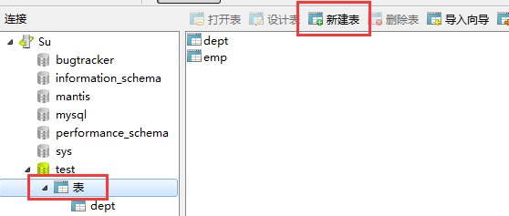

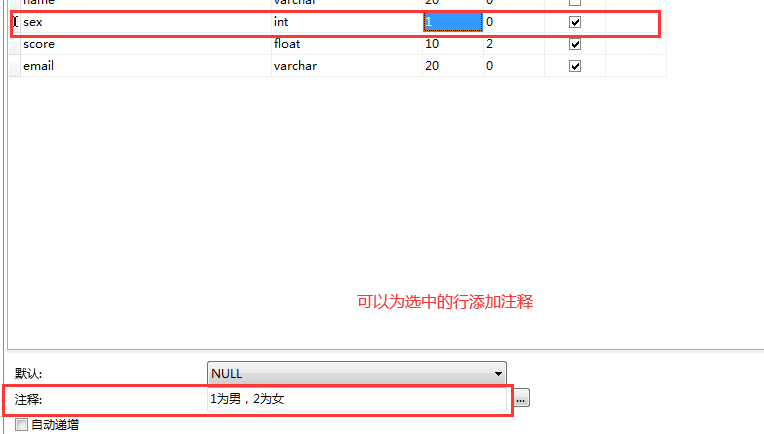

### 2.6.2 约束

#### 1.非空------not null

对应的是界面中的必填项


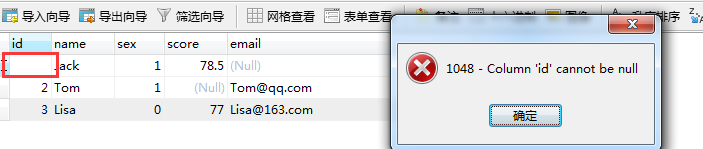

#### 2.唯一------unique

在navicat中的'索引'中找

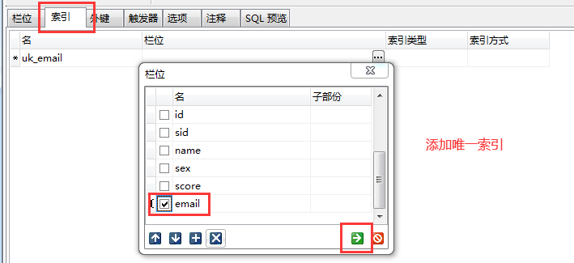

#### 3.主键------pk

pk=not null+unique

主键一般建在一个表的第一个字段上，取名都叫id或**id

一般的表都会有主键（中间表没有主键）

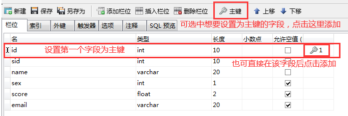

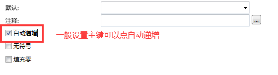


#### 4.外键------fk

mysql中要建立外键，需要把引擎修改成InnoDB

1.要能建立外键，首先修改引擎

2.在‘外键’中建立对应的关系即可

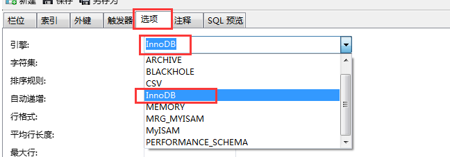

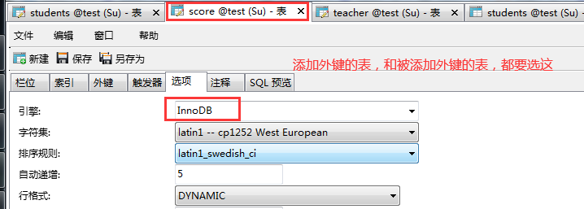

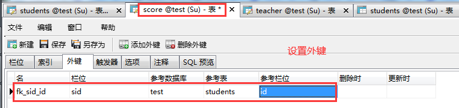

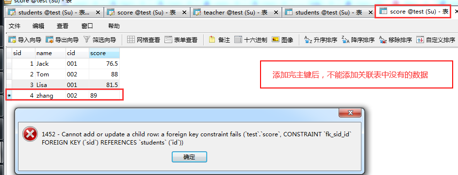


[注意]

**一个表的外键一定是另外一个表的主键**

**先建好独立的表，再来处理外键关系，不能打乱帐**


如果表和表之间有一定的关系，那么就需要这个外键去维护这个关系

如果不建立外键就会出现'脏'数据

关系：一对一、一对多、多对多

一对一

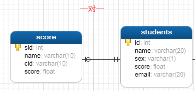

一对多：关系建在多的这端

多对多：建中间表

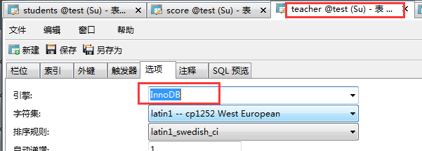

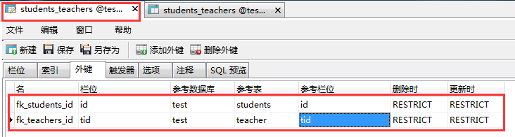

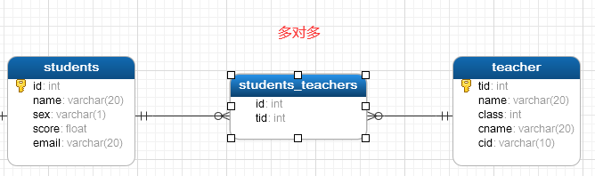

```mysql
#建议写法
select name from student where id in(
select sid from student_teacher where tid=(
select id from teacher where name='张老师'));

#也可以这样,但性能较差
select s.name
from student s,teacher t,student_teacher st
where t.name='张老师'
and s.id=st.sid
and t.id=st.tid;
```


### 2.6.3 索引------index

理解：一本书的目录或一本字典的检索

优点：

1. 大大加快数据的检索速度；
2. 创建唯一性索引，保证数据库表中每一行数据的唯一性；
3. 加速表和表之间的连接；

4. 在使用分组和排序子句进行数据检索时，可以显著减少查询中分组和排序的时间

缺点：

1. 索引需要占物理空间

2. 当对表中的数据进行增加、删除和修改的时候，索引也要动态的维护，降低了数据的维护速度。
3. 增加维护成本


场景举例：

门道招生系统，由于历史数据在不断的增加，查询时速度很慢，通过了解知道用手机号和姓名来查询比较多，

于是就在姓名和手机号字段上加上索引，速度瞬间上去了


提醒：

如果一个表常常用来不断读写，它就不适合特别多的建索引

如果一个表常常是用来读，就非常适合加索引来提高查询速度


### 2.6.4  视图------view

视图是一个虚表（excel中的透视表），在里面只能写select，不能insert、update、delete

就是把主表的数据业务抽取出来形成的一个表，可以很好的保护主表数据

```mysql
#语法:
create or replace view mtesting as
select .....


#调用
select * from mtesting;
```

1.创建视图

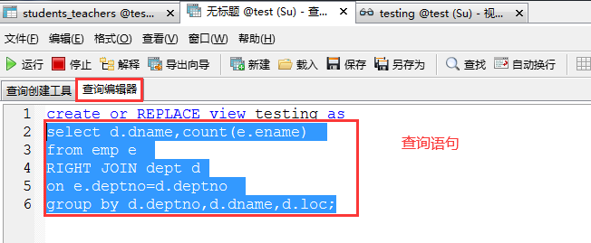

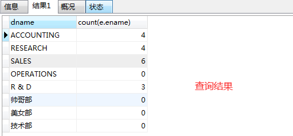

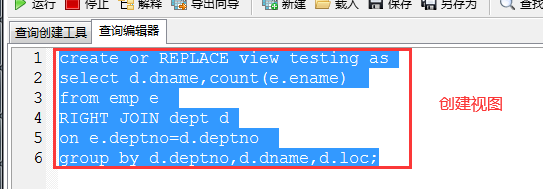

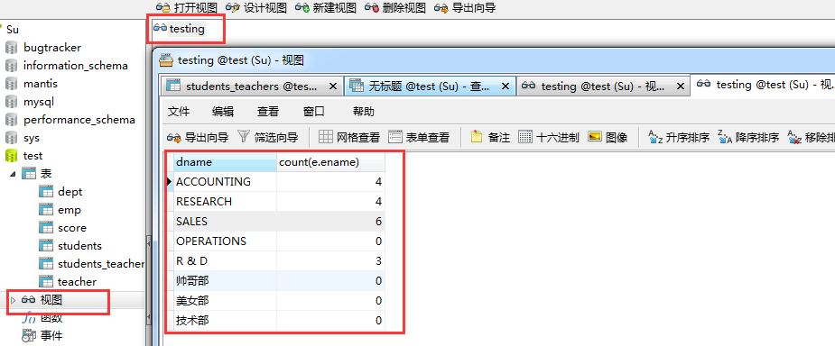

2.编辑视图

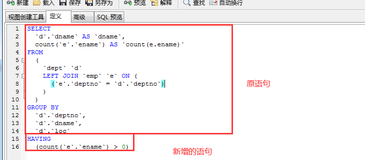

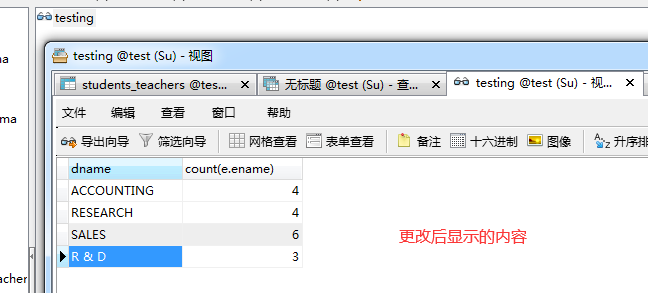

3.调用视图

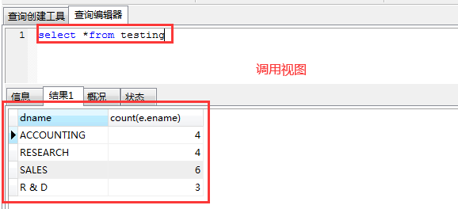


