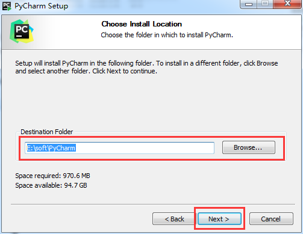
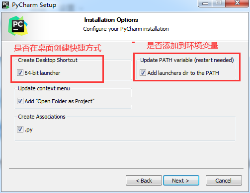
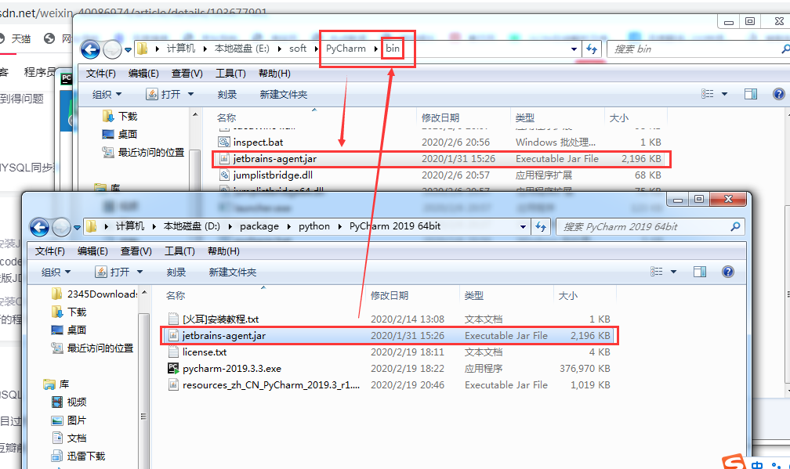
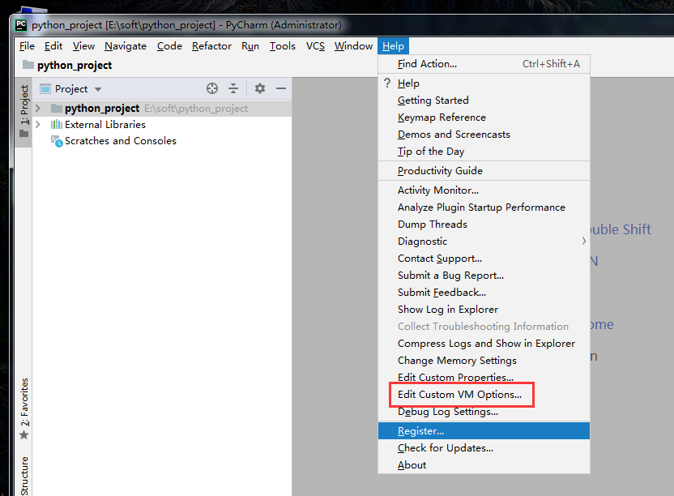
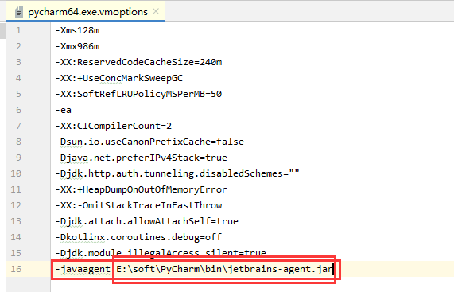
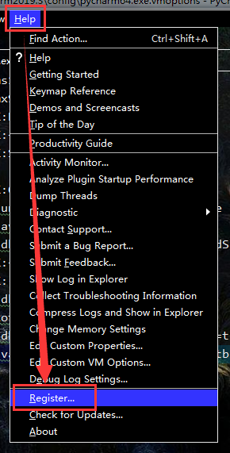
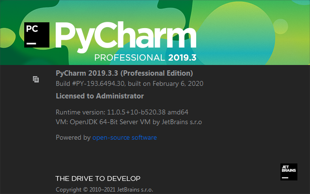
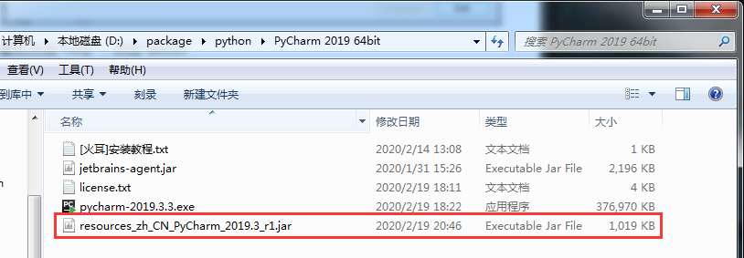
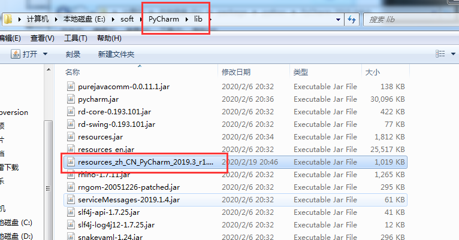

# PyCharm

## 简介

PyCharm是一种Python IDE，带有一整套可以帮用户在使用Python语言开发时提高其效率的工具，比如调试、语法高亮、Project管理、代码跳转、智能提示、自动完成、单元测试、版本控制。

此外，该IDE提供了一些高级功能，以用于支持Django框架下的专业Web开发。

## 安装

选择安装路径

以下内容可根据自己需要选择，也可全选

## 破解

可参照https://blog.csdn.net/weixin_40086974/article/details/103677901

将“jetbrains-agent.jar”放到安装目录的/bin目录下

打开PyCharm，点击“help”，点击红框中内容

最后一行添加：-javaagent:Pycharm安装路径下的\bin\jetbrains-agent.jar

点击“help“，点击”register”

最后点击“help”，点击“about”，可看到破解成功（没有限制时间）

## 汉化

把.jar的汉化包添加到PyCharm安装目录下的/lib文件夹下，重新打开PyCharm即可

可参照https://jingyan.baidu.com/article/fcb5aff7c65690adab4a713b.html

