# Wampserver+Mantis+TestLink

## Wampserver安装

选择安装路径，其他选项可默认下一步

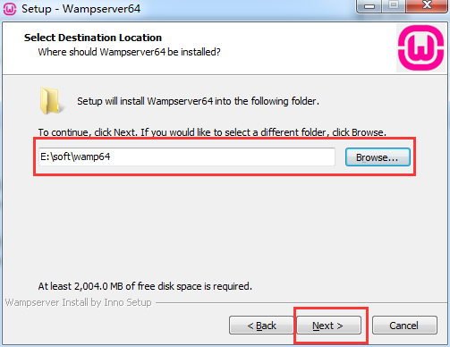

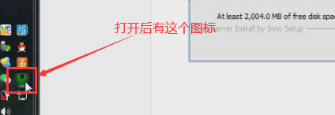

## Mantis

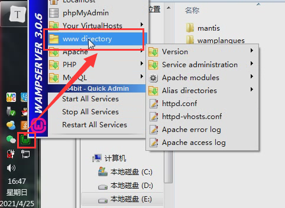

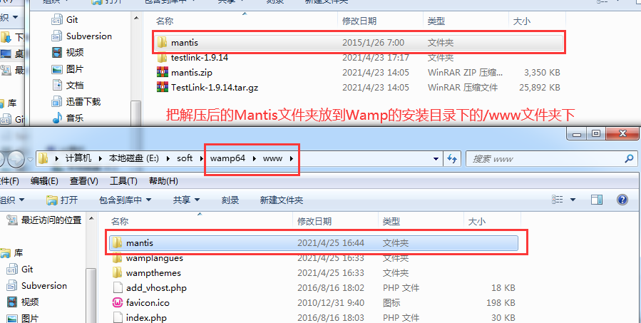

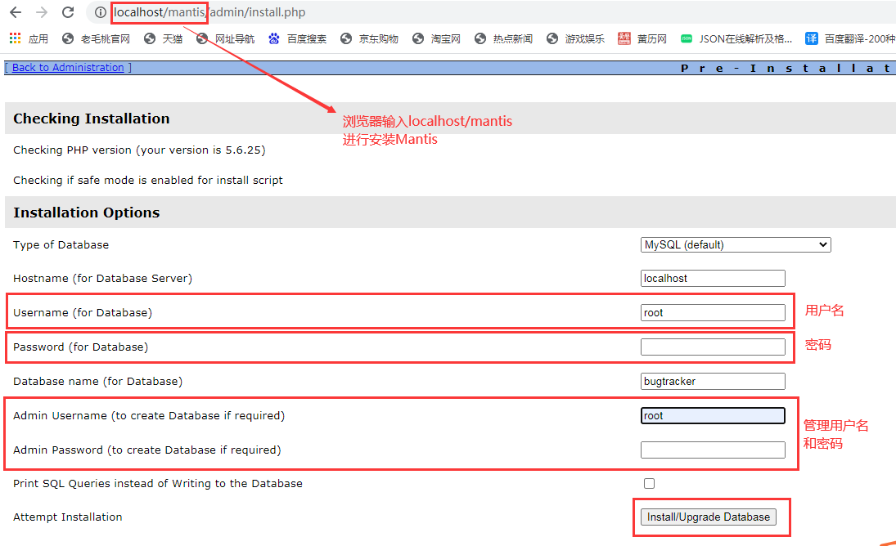

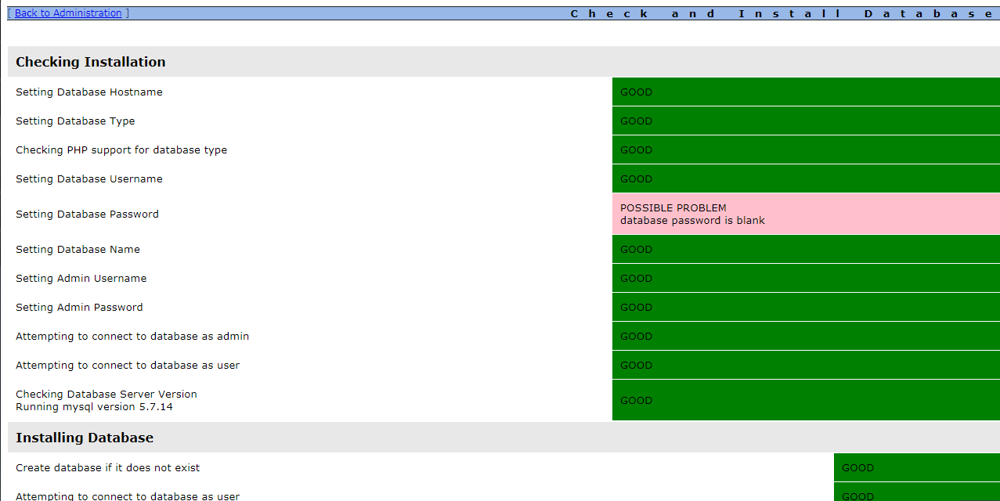

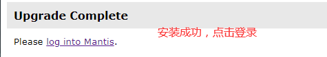

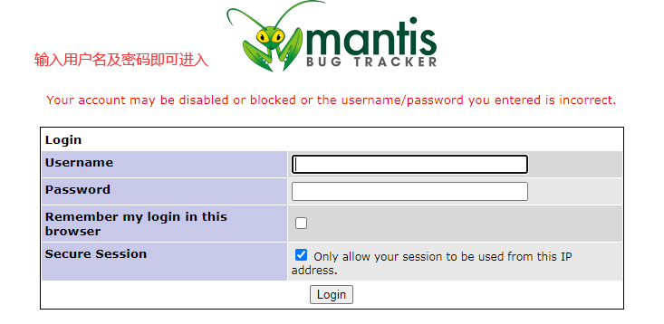

## TestLink

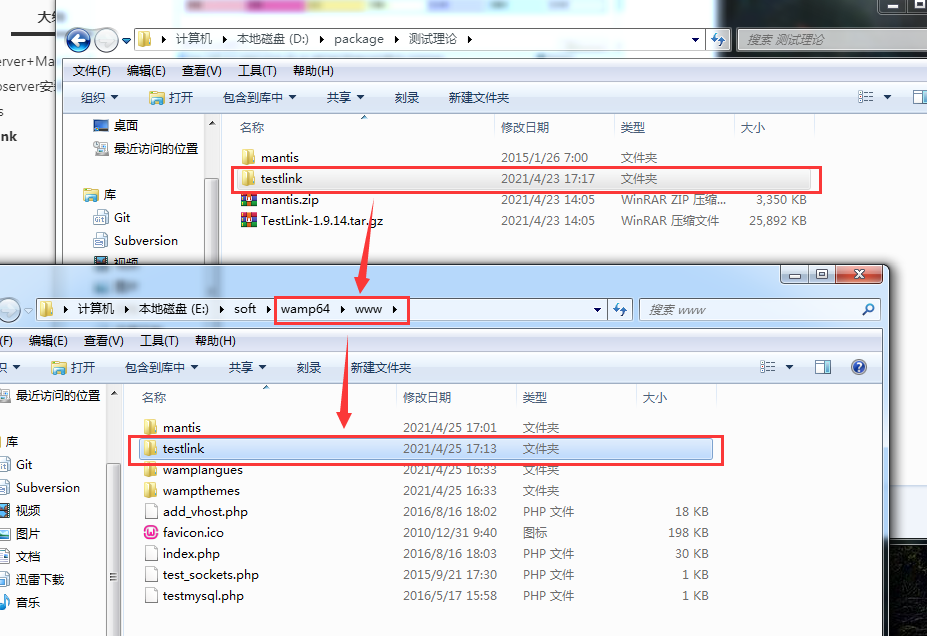

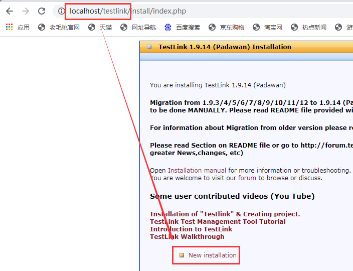

可能会报错需要更改一些文件

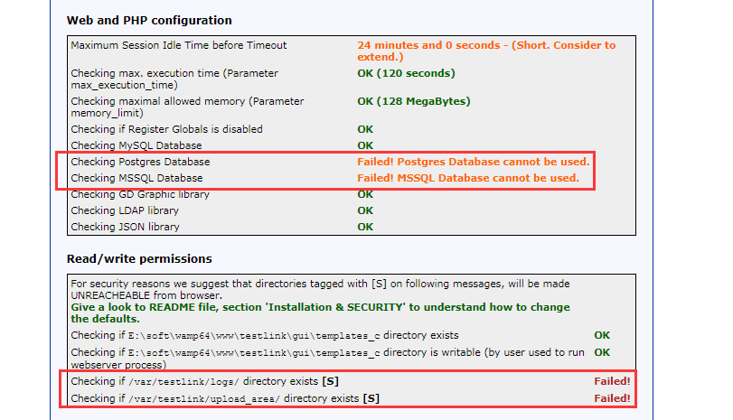

找到testlink下的config.inc.php文件进行一些修改：

将   $tlCfg->log_path = '/var/testlink/logs/';   修改为：$tlCfg->log_path = TL_ABS_PATH."logs"; （也就是testlink下的logs文件夹的路径）

另外还需要将   $g_repositoryPath = '/var/testlink/upload_area/';  修改为：$g_repositoryPath = TL_ABS_PATH."upload_area";  （testlink文件夹下的upload_area的路径）

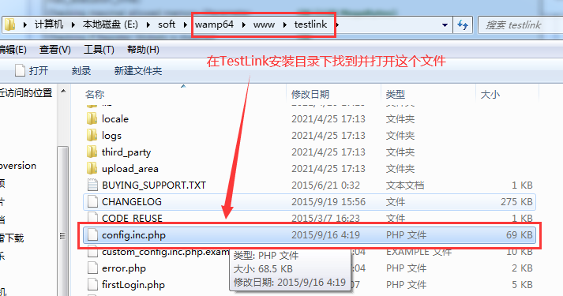

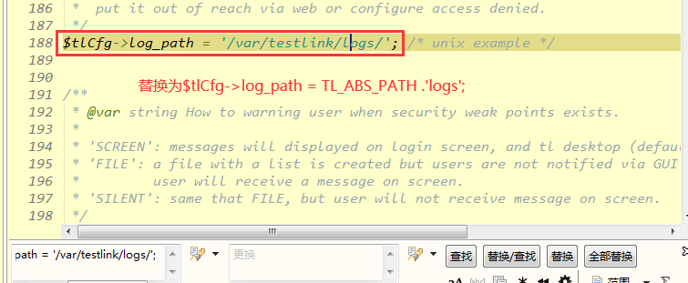

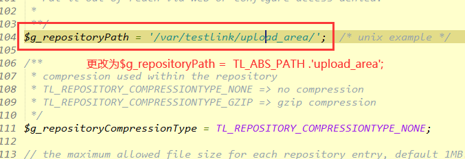

然后浏览器页面重新加载，就能看到不报错了，点击contiune

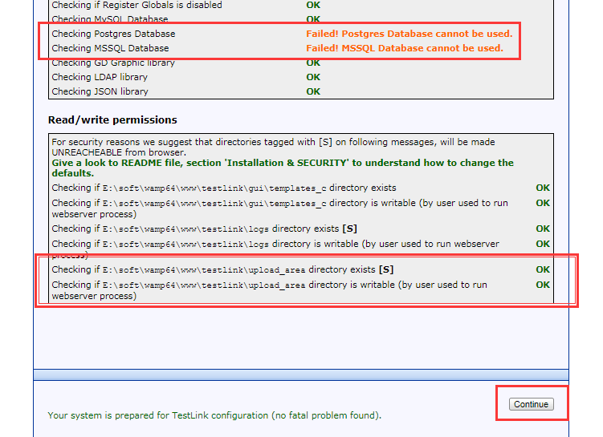

[mysqld]后面添加

sql-mode=ONLY_FULL_GROUP_BY,STRICT_TRANS_TABLES,ERROR_FOR_DIVISION_BY_ZERO,NO_AUTO_CREATE_USER,NO_ENGINE_SUBSTITUTION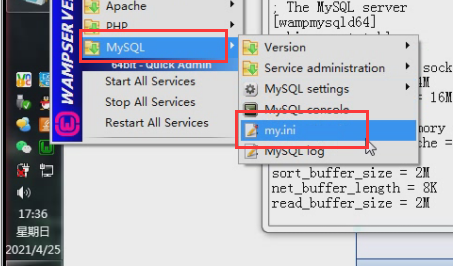

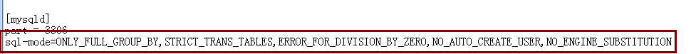

添加并保存后，重启下全部服务

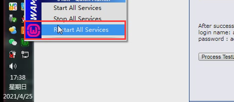

浏览器重新加载，并设置内容

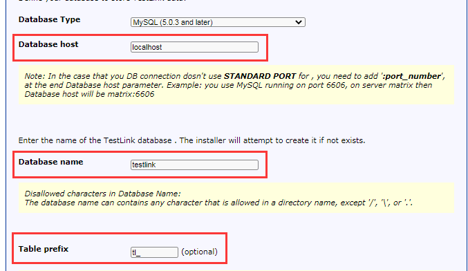

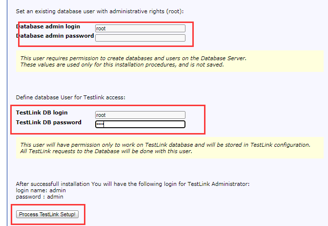

点击Steup后就能看到安装成功了，点击TestLink登录

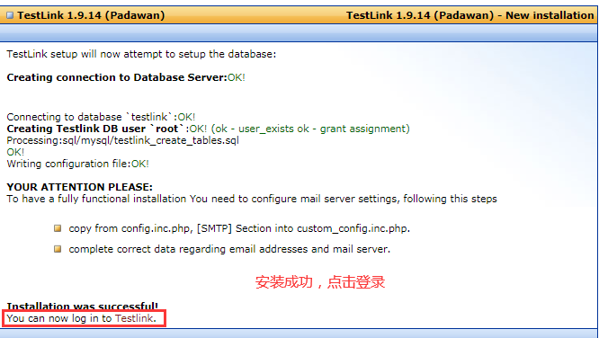

刚安装成功，可能自己创建的用户不能登陆，可用默认的用户登录，默认的用户名及密码都是“admin”

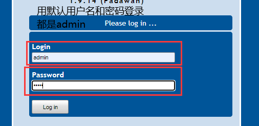

登录成功

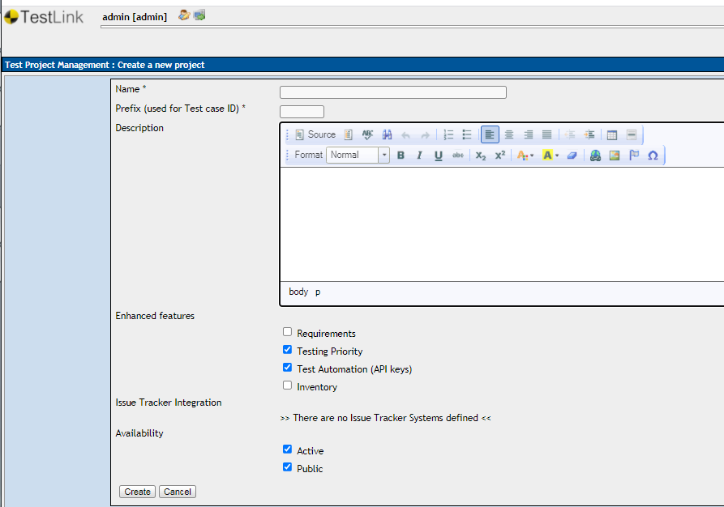