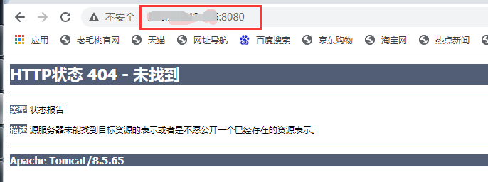
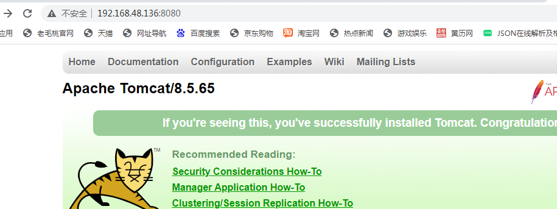

# 1.简介


1.docker是什么? 

- docker是一个**开源的应用容器引擎**，让开发者可以打包他们的应用以及依赖包到一个可移植的容器中，然后发布到任何流行的Linux机器上，也可以实现**虚拟化**

- 容器是完全使用**沙箱机制**，相互之间不会有任何接口（类似iphone）

- 几乎没有性能开销，可以很容易的在机器和数据中心里运行

- 不依赖任何语言、框架、系统

- 开发语言：GO


2.docker解决了什么? 

开发和运维之间以及其他任何环境之间的问题，能够一次成型，到处运行


3.docker的概念：

- 仓库（Repositry）：存放镜像的地方，分为公开仓库和私有仓库

- 镜像（Mirrors）：其实就是模板，跟我们常见的ISO镜像类似，是一个样板

- 容器（Container）：使用镜像常见的应用或系统


# 2.安装

1. 安装在内核3.10+以上才行

   windows和linux上均可安装

2. 无论是工作还是学习，均不考虑在windows上安装

   Centos6.x系列内核不够3.10+，可以升级6的内核，然后安装（升级过程及其痛苦）

   Centos7.x内核够3.10+，所以直接用7即可

3. 预备知识

   安装vm和centos7

   请吃透理论再完成实践

4. 安装


## 2.1 自动安装

```shell
# 查看内核
[root@localhost ~]# uname -r
3.10.0-1062.el7.x86_64
[root@localhost ~]#
```

```shell
# 执行脚本
# yum默认走的是centos的源,如果网络卡,建议换成国内源（参考linux.md）
[root@localhost ~]# curl -sSL https://get.daocloud.io/docker | sh
# Executing docker install script, commit: 7cae5f8b0decc17d6571f9f52eb840fbc13b2737
+ sh -c 'yum install -y -q yum-utils'
Delta RPMs disabled because /usr/bin/applydeltarpm not installed.
...
[root@localhost ~]#
```

```shell
# 安装docker
[root@localhost ~]# yum install docker-ce -y
Loaded plugins: fastestmirror
Loading mirror speeds from cached hostfile
...
```

```shell
# 启动docker
[root@localhost ~]# systemctl start docker
[root@localhost ~]# 
```

```shell
# 测试
[root@localhost ~]# docker -v
Docker version 20.10.6, build 370c289
[root@localhost ~]# 
```


## 2.2 手动安装

Centos6可参考：https://www.cnblogs.com/qds2745/p/8931679.html

Centos7可参考：https://www.jianshu.com/p/96421dd09a3a


# 3.使用


## 3.1 基本命令

```shell
docker version #仅仅打印版本内容
docker info    #有客户端和服务器端的各种信息展示
docker --help  #其实直接docker即可
```


## 3.2 镜像命令

```shell
# 查看docker手册，也可用docker --help
[root@localhost ~]# docker

Usage:  docker [OPTIONS] COMMAND

A self-sufficient runtime for containers

Options:
...
```

```shell
# 
[root@localhost ~]# docker info
Client:
...

Server:
...
[root@localhost ~]#
```

```shell
# 查看docker状态
docker stats

[root@localhost ~]# docker stats
Cannot connect to the Docker daemon at unix:///var/run/docker.sock. Is the docker daemon running?
[root@localhost ~]# systemctl start docker    # 启动docker
[root@localhost ~]#
[root@localhost ~]# docker stats
CONTAINER ID   NAME      CPU %     MEM USAGE / LIMIT   MEM %     NET I/O   BLOCK I/O   PIDS
...
```

```shell
# 查找(docker hub上)是否有要的镜像
docker search 镜像名
# [附录]
# 注意看：stars---受欢迎的程度
# stars表示受欢迎程度,类似于收藏数

[root@localhost ~]# docker search hello
NAME                                       DESCRIPTION                                     STARS     OFFICIAL   AUTOMATED
hello-world                                Hello World! (an example of minimal Dockeriz…   1430      [OK]
kitematic/hello-world-nginx                A light-weight nginx container that demonstr…   149
tutum/hello-world                          Image to test docker deployments. Has Apache…   81                   [OK]
...
```

```shell
# 拉镜像
docker pull 镜像名
# [附录]
# 镜像名默认是最新的(latest)
# 如果要拉其他版本,采用"镜像名:版本号"的方式

# 拉hello-world镜像
[root@localhost ~]# docker pull hello-world
Using default tag: latest
...
[root@localhost ~]#
```

```shell
# 拉Tomcat最新的镜像
[root@localhost ~]# docker pull tomcat
Using default tag: latest
latest: Pulling from library/tomcat
bd8f6a7501cc: Pull complete
44718e6d535d: Pull complete
...
Status: Downloaded newer image for tomcat:latest
docker.io/library/tomcat:latest
[root@localhost ~]#
```

```shell
# 拉Tomcat8.5的镜像
[root@localhost ~]# docker pull tomcat:8.5
...
412254a7aeaf: Pull complete
4e00d9861f01: Pull complete
Digest: sha256:2a39537f6c3c53373fdd047b5b7893f29366926bbe6d4b0740ec58841755febf
Status: Downloaded newer image for tomcat:8.5
docker.io/library/tomcat:8.5
[root@localhost ~]#
```

```shell
# 拉Centos的镜像
[root@localhost ~]# docker pull centos
Using default tag: latest
latest: Pulling from library/centos
7a0437f04f83: Pull complete
Digest: sha256:5528e8b1b1719d34604c87e11dcd1c0a20bedf46e83b5632cdeac91b8c04efc1
Status: Downloaded newer image for centos:latest
docker.io/library/centos:latest
[root@localhost ~]#
```

```shell
# 查看镜像
docker images 
# [附录]
# 参数：
    -a：列出本地所有镜像
	-q：只显示镜像id
	--digests：显示镜像摘要
	--no-trunc：显示完整的镜像信息

[root@localhost ~]# docker images
REPOSITORY    TAG       IMAGE ID       CREATED        SIZE
tomcat        8.5       14dce9c68dd9   2 weeks ago    533MB
tomcat        latest    c0e850d7b9bb   2 weeks ago    667MB
hello-world   latest    d1165f221234   2 months ago   13.3kB
centos        latest    300e315adb2f   5 months ago   209MB
[root@localhost ~]#
```

```shell
# 删除镜像
docker rmi [参数] 镜像名
# [附录]
# 如果删多个就空格隔开(和linux的rm -rf一样)

[root@localhost ~]# docker rmi -f hello-world
Untagged: hello-world:latest
Untagged: hello-world@sha256:f2266cbfc127c960fd30e76b7c792dc23b588c0db76233517e1891a4e357d519
Deleted: sha256:d1165f2212346b2bab48cb01c1e39ee8ad1be46b87873d9ca7a4e434980a7726
Deleted: sha256:f22b99068db93900abe17f7f5e09ec775c2826ecfe9db961fea68293744144bd
[root@localhost ~]#
[root@localhost ~]# docker images
REPOSITORY   TAG       IMAGE ID       CREATED        SIZE
tomcat       8.5       14dce9c68dd9   2 weeks ago    533MB
tomcat       latest    c0e850d7b9bb   2 weeks ago    667MB
centos       latest    300e315adb2f   5 months ago   209MB
[root@localhost ~]#
```


## 3.3 容器命令


### **3.3.1 新建容器**

```shell
# 语法：docker run [option] IMAGE [command] [args]
	option:
	--name="容器新名字": 为容器指定一个名称
	-d: 后台运行容器，并返回容器ID，也即启动守护式容器
	-i：以交互模式运行容器，通常与 -t 同时使用
	-t：为容器重新分配一个伪输入终端，通常与 -i 同时使用
	-P: 随机端口映射
	-p: 指定端口映射，有以下四种格式
          ip:hostPort:containerPort
          ip::containerPort
          hostPort:containerPort
          containerPort
```

```shell
# 300e315adb2f是镜像id,可通过docker images来获得
# 也可以 docker run -it centos(镜像名)
[root@localhost ~]# docker run -it 300e315adb2f
[root@1e350fda00f4 /]#
[root@1e350fda00f4 /]# cd /tmp
[root@1e350fda00f4 tmp]# ll
bash: ll: command not found
[root@1e350fda00f4 tmp]#
[root@1e350fda00f4 tmp]# ls -la
total 8
drwxrwxrwt. 7 root root 145 Dec  4 17:37 .
drwxr-xr-x. 1 root root   6 May  8 06:59 ..
drwxrwxrwt. 2 root root   6 Dec  4 17:37 .ICE-unix
drwxrwxrwt. 2 root root   6 Dec  4 17:37 .Test-unix
...
[root@1e350fda00f4 tmp]#
```

```shell
[root@localhost ~]# docker run -it --name centos_study centos
[root@fc1964ad051a /]#
[root@fc1964ad051a /]# exit
exit
[root@localhost ~]# docker start centos_study
centos_study
[root@localhost ~]# docker ps -a
CONTAINER ID   IMAGE          COMMAND       CREATED          STATUS          PORTS     NAMES
fc1964ad051a   centos         "/bin/bash"   6 minutes ago    Up 3 seconds              centos_study
1e350fda00f4   300e315adb2f   "/bin/bash"   11 minutes ago   Up 11 minutes             admiring_bose
[root@localhost ~]#
```


### 3.3.2 列出当前正在运行的容器

```shell
#单纯的ps只展示正在运行的容器
docker ps

[root@localhost ~]# docker ps
...

#工作中常用docker ps -a来查看所有的容器
[root@localhost ~]# docker ps -a
...
```


### 3.3.3 删除'已停止'容器

```shell
docker rm 容器名/容器id

[root@localhost ~]# docker rm fc1964ad051a
fc1964ad051a
[root@localhost ~]# docker ps
CONTAINER ID   IMAGE          COMMAND             CREATED          STATUS          PORTS                                       NAMES
7571cf04e931   tomcat:8.5     "catalina.sh run"   39 minutes ago   Up 38 minutes   0.0.0.0:8080->8080/tcp, :::8080->8080/tcp   test123
1e350fda00f4   300e315adb2f   "/bin/bash"         2 hours ago      Up 2 hours                                                  admiring_bose
[root@localhost ~]#
```


### 3.3.4 进入正在运行的容器

通过：docker ps可以查看哪些正在跑的容器

```shell
#1.运用多
docker exec -it 容器id /bin/bash
#2.运用少
docker attach 容器ID

#两种方式的区别
attach 直接进入容器启动命令的终端，不会启动新的进程
exec 在容器中打开新的终端，并且可以启动新的进程
```


### 3.3.5 退出容器

```shell
# 1.exit 		#容器停止退出(不多)

root@7571cf04e931:/usr/local/tomcat# exit
exit
[root@localhost tmp]#

# 2.ctrl+p+q    #容器不停止退出(多)  用于从容器内切换到外部
...
root@7571cf04e931:/usr/local/tomcat# read escape sequence
[root@localhost tmp]#
```


### 3.3.6 容器启动/重启/停止/强行停止

```shell
#前提:已存在容器
#如何知道已存在哪些容器:docker ps -a
docker start/restart/stop 容器名/id
```

1.启动------docker start

```shell
[root@localhost ~]# docker ps -a
CONTAINER ID   IMAGE          COMMAND             CREATED          STATUS                        PORTS                                       NAMES
891915d0ebf6   centos         "/bin/bash"         32 seconds ago   Exited (130) 10 seconds ago                                               centos-Su
...
[root@localhost ~]# docker start centos-Su
centos-Su
[root@localhost ~]# docker ps -a
CONTAINER ID   IMAGE          COMMAND             CREATED          STATUS          PORTS                                       NAMES
891915d0ebf6   centos         "/bin/bash"         50 seconds ago   Up 2 seconds                                                centos-Su
...
[root@localhost ~]#
```

2.重启------docker restart

```shell
[root@localhost ~]# docker start centos-Su
centos-Su
[root@localhost ~]#
[root@localhost ~]# docker ps -a
CONTAINER ID   IMAGE          COMMAND             CREATED          STATUS              PORTS                                       NAMES
891915d0ebf6   centos         "/bin/bash"         2 minutes ago    Up About a minute                                               centos-Su
...
[root@localhost ~]#
```

3.停止------docker stop

```shell
[root@localhost ~]# docker stop fc1964ad051a
fc1964ad051a
[root@localhost ~]#
[root@localhost ~]# docker ps -a
CONTAINER ID   IMAGE          COMMAND             CREATED          STATUS                     PORTS                                       NAMES
7571cf04e931   tomcat:8.5     "catalina.sh run"   38 minutes ago   Up 38 minutes              0.0.0.0:8080->8080/tcp, :::8080->8080/tcp   test123
fc1964ad051a   centos         "/bin/bash"         2 hours ago      Exited (0) 2 seconds ago                                               centos_study
...
```

4.强行停止

```shell
docker kill 容器名/id
```

```shell
[root@localhost ~]# docker kill 891915d0ebf6
891915d0ebf6
[root@localhost ~]#
[root@localhost ~]# docker ps -a
CONTAINER ID   IMAGE          COMMAND             CREATED          STATUS                       PORTS                                       NAMES
891915d0ebf6   centos         "/bin/bash"         4 minutes ago    Exited (137) 2 seconds ago                                               centos-Su
...
[root@localhost ~]#
```


### 3.3.7 从容器内拷贝文件到主机上

```shell
docker cp 容器ID:容器内的路径 主机目录
```

复制文件夹

```shell
[root@localhost ~]# docker exec -it test123 /bin/bash
root@7571cf04e931:/usr/local/tomcat#
root@7571cf04e931:/usr/local/tomcat# ls -l
...
drwxrwxrwx. 1 root root   177 May  8 07:57 logs
...
root@7571cf04e931:/usr/local/tomcat#
root@7571cf04e931:/usr/local/tomcat# pwd
/usr/local/tomcat
root@7571cf04e931:/usr/local/tomcat#
```

```shell
[root@localhost tmp]# docker cp test123:/usr/local/tomcat/logs ./
[root@localhost tmp]#
[root@localhost tmp]# ls -l
...
drwxrwxrwx. 2 root root 177 May  8 03:57 logs
...
[root@localhost tmp]#]
```

复制文件

```shell
[root@localhost tmp]# docker cp test123:/usr/local/tomcat/logs/catalina.2021-05-08.log ./
[root@localhost tmp]# ls -l
...
-rw-r-----. 1 root root 6396 May  8 04:27 catalina.2021-05-08.log
...
[root@localhost tmp]#
```


### 3.3.8 备份

```shell
docker commit -a='作者' -m='镜像描述'  容器ID  新的镜像名/名称:版本
```

```shell
[root@localhost tmp]# docker commit -a='Test_tomcat' -m='this is my tomcat' test123 mytomcat:1.0
sha256:10656f351c2d22a14e496e38c31fc9af2fab44fc5e0a7491e3f5390ea712fcf4
[root@localhost tmp]#
[root@localhost tmp]# docker images
REPOSITORY   TAG       IMAGE ID       CREATED          SIZE
mytomcat     1.0       10656f351c2d   18 seconds ago   538MB
...
[root@localhost tmp]#
```


## 3.4容器卷

目的：数据持久化（保存数据，实现容器之间的数据共享等）
特点：

1.	数据卷可在容器之间共享或重用数据
2.	卷中的更改可以直接生效
3.	数据卷中的更改不会包含在镜像的更新中
4.	数据卷的生命周期一直持续到没有容器使用它为止

```shell
docker run -it -v /myData:/dataContainer 镜像名(centos)
docker run -it -v /myData:/dataContainer:ro 镜像名(centos)
				  本机路径:容器路径[:ro]
ro:只读（read-only）
```


docker run -it --name students_tomcat -p 8084:8080 -v /tmp/data/tomcat_data:/usr/local/tomcat/webapps tomcat:8.5


students_tomcat


## 3.4 案例

### 3.4.1 安装tomcat

```shell
# 1.拉取镜像：
docker pull tomcat:8.5
```

```shell
# 2.创建tomcat容器：
docker run -d --name tomcat_test -p 8080:8080 tomcat:8.5

[root@localhost ~]# docker run -d --name test123 -p 8080:8080 tomcat:8.5
7571cf04e931f3efe3892942711d9906d39b813aeb5ab5955a9ef4055c3f5068
[root@localhost ~]#
[root@localhost ~]# docker ps -a
CONTAINER ID   IMAGE          COMMAND             CREATED          STATUS          PORTS                                       NAMES
7571cf04e931   tomcat:8.5     "catalina.sh run"   4 seconds ago    Up 3 seconds    0.0.0.0:8080->8080/tcp, :::8080->8080/tcp   test123
...

#打开浏览器输入http://linux的ip:8080,就可以.但如访问出现404, 是因为webapps文件夹下内容为空，内容都在webapps.dist 目录下,所以进入容器删除掉webapps,重命名webapps.dist为webapps即可
```



```shell
# 3.进入容器：
docker exec -it tomcat_test /bin/bash

[root@localhost ~]# docker exec -it test123 /bin/bash
root@7571cf04e931:/usr/local/tomcat#
root@7571cf04e931:/usr/local/tomcat# pwd
/usr/local/tomcat
root@7571cf04e931:/usr/local/tomcat# ls -l
...
drwxr-xr-x. 2 root root     6 Apr 22 23:15 webapps
drwxr-xr-x. 7 root root    81 Mar 30 12:28 webapps.dist
...
```

```shell
# 4.删除webapps目录:
rm -rf webapps
```

```shell
#5.重命名目录：
mv webapps.dist/ webapps
```

```shell
#6.再次启动浏览器，输入：http://linux的ip:8080，即可

#[附]可做可不做
#可备份一下，使其成为基础的tomcat，以后直接引用就行：docker commit -a='caichang' -m='tomcat基础镜像' c006dd416916 basic_tomcat:1.0
```




### 3.4.2 安装mysql

```shell
# 1.拉取mysql镜像
docker pull mysql:5.7
```

```mysql
[root@localhost ~]# docker pull mysql:5.7
5.7: Pulling from library/mysql
...
Status: Downloaded newer image for mysql:5.7
docker.io/library/mysql:5.7
[root@localhost ~]#
[root@localhost ~]# docker images
...
mysql        5.7       87eca374c0ed   2 weeks ago    447MB
...
[root@localhost ~]#
```

```shell
# 2.新建容器
docker run --name Su_mysql -itd -p 3306:3306 -e MYSQL_ROOT_PASSWORD=root mysql:5.7
```

```shell
[root@localhost ~]# docker run -itd --name Su_mysql -p 3306:3306 -e MYSQL_ROOT_PASSWORD=root mysql:5.7
a57cce8848fab0852c9e5ec9f9976b43256127511420baba2e56caf9c9f2dc75
[root@localhost ~]#
[root@localhost ~]# docker ps
CONTAINER ID   IMAGE       COMMAND                  CREATED          STATUS          PORTS                                                  NAMES
a57cce8848fa   mysql:5.7   "docker-entrypoint.s…"   4 seconds ago    Up 3 seconds    0.0.0.0:3306->3306/tcp, :::3306->3306/tcp, 33060/tcp   Su_mysql
...
[root@localhost ~]#
```


### 3.4.3 安装nginx

```shell
[root@localhost ~]# docker pull nginx:1.10
1.10: Pulling from library/nginx
...
[root@localhost ~]#
[root@localhost ~]# docker images
...
nginx        1.10      0346349a1a64   4 years ago    182MB
[root@localhost ~]# docker run -itd --name Su_nginx -p 80:80 0346349a1a64
6454ccf64a2a15d4fd1a1bda02e6930d1fb4906f3ceac07a056400247846e5a1
[root@localhost ~]#
[root@localhost ~]# docker ps
CONTAINER ID   IMAGE          COMMAND                  CREATED          STATUS          PORTS                                                  NAMES
6454ccf64a2a   0346349a1a64   "nginx -g 'daemon of…"   6 seconds ago    Up 5 seconds    0.0.0.0:80->80/tcp, :::80->80/tcp, 443/tcp             Su_nginx
...
[root@localhost ~]#
```

```shell
root@6454ccf64a2a:/# apt-get update
Get:1 http://security.debian.org jessie/updates InRelease [44.9 kB]
Ign http://deb.debian.org jessie InRelease
Get:2 http://nginx.org jessie InRelease [2856 B]
...
root@6454ccf64a2a:/#
```

```shell
root@6454ccf64a2a:/# apt-get install -y vim
Reading package lists... Done
Building dependency tree
Reading state information... Done
...
```

