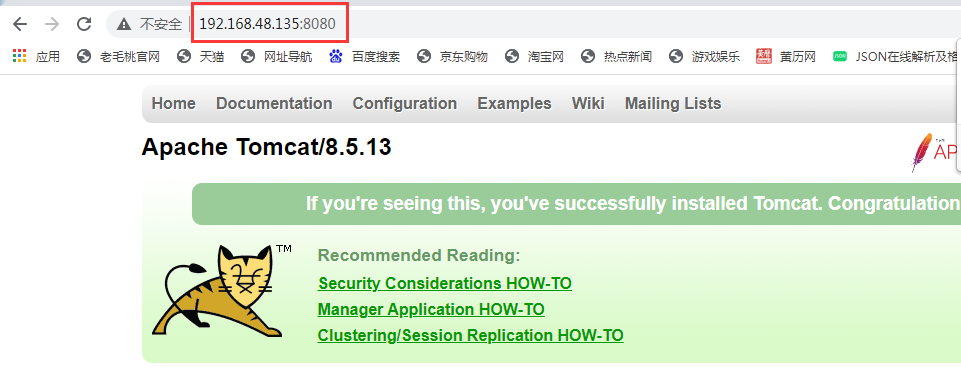
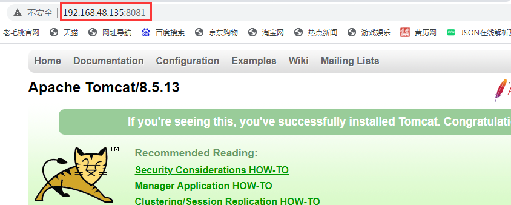
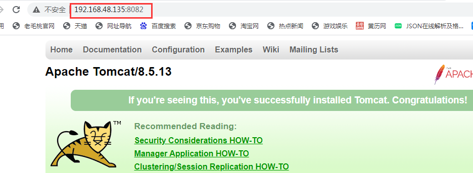
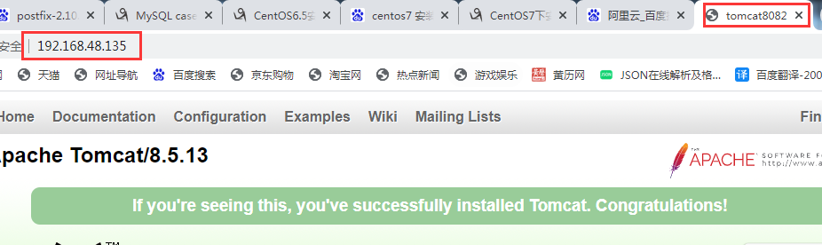
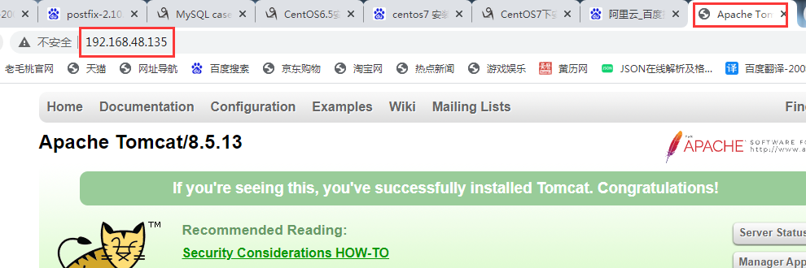
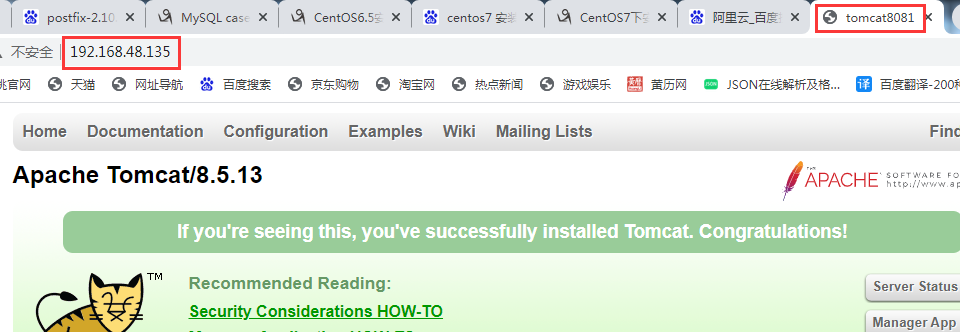

# 基本命令练习

## 创建

```mysql
[root@localhost /]# cd /tmp    # 切换目录
[root@localhost tmp]# ll    #查看当前目录信息
```

```mysql
[root@localhost tmp]# mkdir test111    # 创建文件夹
[root@localhost tmp]# touch test0000    # 创建文件
[root@localhost tmp]# ll
...
-rw-r--r--. 1 root  root          0 May  3 07:48 test0000
drwxr-xr-x. 2 root  root       4096 May  3 07:48 test111
...
```

```mysql
# 同时创建多个文件夹
[root@localhost tmp]# mkdir 1231 2324 test333

# 创建一个多级文件夹
[root@localhost tmp]# mkdir -p demo001/demo002/demo
[root@localhost tmp]# ll
drwxr-xr-x. 2 root  root       4096 May  3 08:02 1231
drwxr-xr-x. 2 root  root       4096 May  3 08:02 2324
...
drwxr-xr-x. 3 root  root       4096 May  3 08:02 demo001
...
[root@localhost tmp]# ll demo001/demo002/
total 4
drwxr-xr-x. 2 root root 4096 May  3 08:02 demo
```

## 删除

```mysql
# rmdir删除空文件夹
[root@localhost tmp]# rmdir test111/    # 删除空文件夹
[root@localhost tmp]#
[root@localhost tmp]# rmdir demo001/    # 删除不为空的文件夹
rmdir: failed to remove `demo001/': Directory not empty
[root@localhost tmp]#
```

```mysql
# rm -rf删除
[root@localhost tmp]# rm -rf demo001/demo002/demo/    # 删除文件夹下的demo
[root@localhost tmp]# ll demo001/demo002/
total 0
[root@localhost tmp]# ll demo001/
total 4
drwxr-xr-x. 2 root root 4096 May  3 08:13 demo002
```

## 复制

```mysql
# 复制文件
[root@localhost tmp]# cp test0000 demo001/demo002/
[root@localhost tmp]# ll demo001/demo002/
total 0
-rw-r--r--. 1 root root 0 May  3 08:17 test0000
```

```mysql
# 复制文件夹
[root@localhost tmp]# cp -r demo001/demo002/ 55555
[root@localhost tmp]# ll
drwxr-xr-x. 3 root  root       4096 May  3 08:20 1231
drwxr-xr-x. 2 root  root       4096 May  3 08:02 2324
drwxr-xr-x. 2 root  root       4096 May  3 08:18 55555
...
```

## 剪切、重命名

```mysql
# 剪切文件夹
[root@localhost tmp]# mv 55555/ 1231/
[root@localhost tmp]# ll 1231/
total 4
drwxr-xr-x. 2 root root 4096 May  3 08:18 55555
[root@localhost tmp]# ll
total 188648
drwxr-xr-x. 3 root  root       4096 May  3 08:20 1231
drwxr-xr-x. 2 root  root       4096 May  3 08:02 2324
-rw-------. 1 root  root      31397 Apr 30 11:26 anaconda-tb-fQCtNn
...
```

```mysql
# 剪切文件
[root@localhost tmp]# mv test0000 1231/
[root@localhost tmp]# ll
...
drwx------. 2 gdm   gdm        4096 May  3 03:50 pulse-fA5jO5YpZKJB
drwxr-xr-x. 2 root  root       4096 May  3 08:02 test333
...
[root@localhost tmp]# ll 1231/
total 4
drwxr-xr-x. 2 root root 4096 May  3 08:18 55555
-rw-r--r--. 1 root root    0 May  3 07:48 test0000
```

```mysql
# 重命名
[root@localhost tmp]# mv 1231/ 6666
[root@localhost tmp]# ll
total 188648
drwxr-xr-x. 2 root  root       4096 May  3 08:02 2324
drwxr-xr-x. 3 root  root       4096 May  3 08:22 6666
...
```

## 查看

```mysql
[root@localhost tmp]# pwd    # 查看当前位置
/tmp
```

```mysql
# man手册
[root@localhost tmp]# man ls
LS(1)                            User Commands                           LS(1)

NAME
       ls - list directory contents
...
# q退出
```

```mysql
# 查看文档
# cat    适合看小文档
[root@localhost tmp]# cat 121.txt
.encoding = "utf-8"
asianux3 = "linuxPreGlibc25.iso"
asianux3-64 = "linuxPreGlibc25.iso"
asianux4 = "linuxPreGlibc25.iso"
asianux4-64 = "linuxPreGlibc25.iso"
...
```

```mysql
# more    不能向上翻
[root@localhost tmp]# more 121.txt
.encoding = "utf-8"
asianux3 = "linuxPreGlibc25.iso"
asianux3-64 = "linuxPreGlibc25.iso"
...
--More--(18%)
```

```mysql
# less    可以上下翻
[root@localhost tmp]# less 121.txt
.encoding = "utf-8"
asianux3 = "linuxPreGlibc25.iso"
asianux3-64 = "linuxPreGlibc25.iso"
....
121.txt
```

```mysql
# tac    反着看
[root@localhost tmp]# tac 121.txt
...
asianux3-64 = "linuxPreGlibc25.iso"
asianux3 = "linuxPreGlibc25.iso"
.encoding = "utf-8"
[root@localhost tmp]# 
```

```mysql
# tail -f -n   查看文件后多少行
[root@localhost tmp]# tail -f -n 5 121.txt
winVista = "windows.iso"
winVista-64 = "windows.iso"
winXPHome = "winPreVista.iso"
winXPPro = "winPreVista.iso"
winXPPro-64 = "winPreVista.iso"
^C
[root@localhost tmp]#
```

## zip压缩、解压

### 压缩

```mysql
[root@localhost tmp]# zip -r test 2324 6666 demo001 test333
updating: 2324/ (stored 0%)
updating: 6666/ (stored 0%)
...
[root@localhost tmp]# ll
...
-rw-r--r--. 1 root  root       1392 May  3 08:39 test.zip
...
[root@localhost tmp]# rm -rf 2324 6666 demo001 test333
[root@localhost tmp]# ll
total 188660
-rw-r--r--. 1 root  root       4852 May 10  2017 121.txt
...
-rw-------. 1 root  root      31397 Apr 30 11:26 anaconda-tb-fQCtNn
drwxr-xr-x. 9 root  root       4096 May  3 04:41 apache-tomcat-
...
```

### 解压

```mysql
[root@localhost tmp]# unzip test.zip
Archive:  test.zip
   creating: 2324/
   creating: 6666/
...
[root@localhost tmp]# ll
total 188660
-rw-r--r--. 1 root  root       4852 May 10  2017 121.txt
drwxr-xr-x. 2 root  root       4096 May  3 08:02 2324
drwxr-xr-x. 3 root  root       4096 May  3 08:22 6666
...
drwxr-xr-x. 3 root  root       4096 May  3 08:02 demo001
...
```

## tar打包、解压

### 打包

```mysql
[root@localhost tmp]# tar cvf 3128.tar test.zip 121.txt 2324 6666 demo001 test333 test.zip
test.zip
121.txt
2324/
6666/
6666/55555/
...
```

### 删除测试

```mysql
[root@localhost tmp]# rm -rf 2324 121.txt 6666 demo001 test333 test.zip
[root@localhost tmp]# ll
total 188644
-rw-r--r--. 1 root  root      10240 May  3 08:47 3128.tar
-rw-------. 1 root  root      31397 Apr 30 11:26 anaconda-tb-fQCtNn
drwxr-xr-x. 9 root  root       4096 May  3 04:41 apache-tomcat-8.5.13
...
```

### 解压

```mysql
[root@localhost tmp]# [root@localhost tmp]# tar xvf 3128.tar
test.zip
121.txt
2324/
6666/
6666/55555/
...
[root@localhost tmp]# ll
total 188672
-rw-r--r--. 1 root  root       4852 May 10  2017 121.txt
drwxr-xr-x. 2 root  root       4096 May  3 08:02 2324
-rw-r--r--. 1 root  root      10240 May  3 08:47 3128.tar
drwxr-xr-x. 3 root  root       4096 May  3 08:22 6666
...
```

### 查看安装包

```mysql
[root@localhost tmp]# tar -tf 3128.tar
test.zip
121.txt
2324/
6666/
...
```

### 追加到安装包

```mysql
[root@localhost tmp]# mkdir test_demo
[root@localhost tmp]# tar -rf 3128.tar test_demo/
[root@localhost tmp]# tar -tf 3128.tar
test.zip
121.txt
2324/
...
test_demo/
[root@localhost tmp]#
```

### 删除内容

```mysql
[root@localhost tmp]# tar --delete -f 3128.tar demo001/
[root@localhost tmp]# tar -tf 3128.tar
test.zip
121.txt
...
test333/
test.zip
test_demo/
[root@localhost tmp]#
```

## GZ压缩、解压

### 压缩

```mysql
[root@localhost tmp]# gzip 3128.tar
[root@localhost tmp]# ll
...
-rw-r--r--. 1 root  root       1431 May  3 08:58 3128.tar.gz
...
```

### 解压

```mysql
[root@localhost tmp]# gunzip 3128.tar.gz
[root@localhost tmp]# ll
...
-rw-r--r--. 1 root  root      20480 May  3 08:58 3128.tar
...
```

## 一次性打包又压缩 

### 压缩

```mysql
[root@localhost tmp]# tar zcvf t_demo.tar.gz 121.txt 2324 6666 demo001 test333 test_demo test.zip
121.txt
2324/
...
test_demo/
test.zip
[root@localhost tmp]#
```

### 删除测试

```mysql
[root@localhost tmp]# rm -rf 121.txt 2324 6666 demo001 test333 test_demo test.zip
[root@localhost tmp]#
[root@localhost tmp]# ll
total 188640
-rw-r--r--. 1 root  root         45 May  3 09:02 3128.tar.gz
-rw-------. 1 root  root      31397 Apr 30 11:26 anaconda-tb-fQCtNn
...
```

### 解压

```mysql
[root@localhost tmp]# tar zxvf t_demo.tar.gz
121.txt
2324/
...
demo001/demo002/test0000
test333/
test_demo/
test.zip
[root@localhost tmp]# ll
total 188672
-rw-r--r--. 1 root  root       4852 May 10  2017 121.txt
drwxr-xr-x. 2 root  root       4096 May  3 08:02 2324
...
drwxr-xr-x. 3 root  root       4096 May  3 08:02 demo001
```

## vi编辑器

```mysql
[root@localhost tmp]# vi 121.txt
.encoding = "utf-8"
asianux3 = "linuxPreGlibc25.iso"
asianux3-64 = "linuxPreGlibc25.iso"
...
```

### 命令模式

```mysql
# i    在光标前插入
...
debian6-64 = "linux.iso"
debian7 = "linux.iso"
-- INSERT --
```

```mysql
# a    在光标后插入
...
debian6 = "linux.iso"
debian6-64 = "linux.iso"
debian7 = "linux.iso"
-- INSERT --
```

```mysql
# o    光标下一行插入
.encoding = "utf-8"

asianux3 = "linuxPreGlibc25.iso"
asianux3-64 = "linuxPreGlibc25.iso"
asianux4 = "linuxPreGlibc25.iso"
...
-- INSERT --
```

### 末行模式

```mysql
# wq    保存并退出
...
debian6-64 = "linux.iso"
debian7 = "linux.iso"

:wq
```

```mysql
# q    退出,没做更改是使用
debian5-64 = "linuxPreGlibc25.iso"
debian6 = "linux.iso"
debian6-64 = "linux.iso"
debian7 = "linux.iso"
:q
```

```mysql
# q！    强制退出，不保存
debian6 = "linux.iso"
debian6-64 = "linux.iso"
debian7 = "linux.iso"
:q!
```

```mysql
# w     保存，但不退出
debian5-64 = "linuxPreGlibc25.iso"
debian6 = "linux.iso"
debian6-64 = "linux.iso"
debian7 = "linux.iso"
:w
```

```mysql
# 显示行号
     ...
     30 debian6 = "linux.iso"
     31 debian6-64 = "linux.iso"
     32 debian7 = "linux.iso"
:set number
```

```mysql
# 取消显示行号
...
debian6-64 = "linux.iso"
debian7 = "linux.iso"
:set nonumber
```

## 进程

### 查看进程

```mysql
# 查看某一进程
[root@localhost tmp]# ps -ef | grep httpd
root     29843  2868  0 09:28 pts/1    00:00:00 grep httpd
[root@localhost tmp]#
[root@localhost tmp]# ps -ef | grep java
root     28934     1  0 04:44 pts/1    00:00:46 /usr/bin/java -Djava.util.logging.config.file=/usr/java/tomcat8080/conf/logging.properties -Djava.util.logging.manager=org.apache.juli.ClassLoaderLogManager -Djdk.tls.ephemeralDHKeySize=2048 -Djava.protocol.handler.pkgs=org.apache.catalina.webresources -classpath ...
```

```mysql
# 查看实时进程
[root@localhost tmp]# top
top - 09:33:44 up  5:44,  3 users,  load average: 0.00, 0.00, 0.00
Tasks: 156 total,   1 running, 155 sleeping,   0 stopped,   0 zombie
Cpu(s):  0.3%us,  0.3%sy,  0.0%ni, 98.7%id,  0.7%wa,  0.0%hi,  0.0%si,  0.0%st
Mem:   1030316k total,  1009796k used,    20520k free,    49396k buffers
Swap:  2064380k total,       56k used,  2064324k free,   559568k cached
...
# ctrl+c强制结束
```

### 杀死进程

```mysql
# 杀死某一进程
[root@localhost tmp]# ps -ef | grep nginx
root     29227     1  0 05:22 ?        00:00:00 nginx: master process ./nginx
nobody   29896 29227  0 09:37 ?        00:00:00 nginx: worker process
root     29905  2868  0 09:40 pts/1    00:00:00 grep nginx
[root@localhost tmp]#
[root@localhost tmp]# kill -9 29896      # -9强制执行
[root@localhost tmp]#
[root@localhost tmp]# ps -ef | grep nginx
root     29227     1  0 05:22 ?        00:00:00 nginx: master process ./nginx
nobody   29906 29227  0 09:41 ?        00:00:00 nginx: worker process
root     29908  2868  0 09:41 pts/1    00:00:00 grep nginx
[root@localhost tmp]#
```

```mysql
# 杀死全部进程------pkill
[root@localhost tmp]# pkill nginx
[root@localhost tmp]#
[root@localhost tmp]# ps -ef | grep nginx
root     29927  2868  0 09:42 pts/1    00:00:00 grep nginx
[root@localhost tmp]#
```

```mysql
# 杀死全部进程------killall
[root@localhost tmp]# ps -ef | grep nginx
root     29929     1  0 09:44 ?        00:00:00 nginx: master process ./nginx
nobody   29930 29929  0 09:44 ?        00:00:00 nginx: worker process
root     29932  2868  0 09:44 pts/1    00:00:00 grep nginx
[root@localhost tmp]#
[root@localhost tmp]# killall nginx
[root@localhost tmp]#
[root@localhost tmp]# ps -ef | grep nginx
root     29935  2868  0 09:44 pts/1    00:00:00 grep nginx
[root@localhost tmp]#
```

## 系统管理

```mysql
# 查看cpu的信息
[root@localhost tmp]# more /proc/cpuinfo
processor       : 0
vendor_id       : GenuineIntel
cpu family      : 6
model           : 58
...
--More--(0%)
```

```mysql
# 查看查看内存信息
[root@localhost tmp]# more /proc/meminfo
MemTotal:        1030316 kB
MemFree:           21892 kB
Buffers:           49988 kB
Cached:           559692 kB
SwapCached:           56 kB
...
--More--(0%)
```

```mysql
# 查看内存占用
[root@localhost tmp]# free -m
             total       used       free     shared    buffers     cached
Mem:          1006        984         21          3         48        546
-/+ buffers/cache:        389        616
Swap:         2015          0       2015
[root@localhost tmp]#
```

```mysql
# 查看硬盘占用
[root@localhost tmp]# df -h
Filesystem      Size  Used Avail Use% Mounted on
/dev/sda2        18G  3.4G   14G  21% /
tmpfs           504M  376K  503M   1% /dev/shm
/dev/sda1       283M   33M  236M  13% /boot
[root@localhost tmp]#
```

```mysql
# 查看当前目录下的各个文件/文件夹的比重
[root@localhost tmp]# du -sh *
8.0K    121.txt
4.0K    2324
4.0K    3128.tar.gz
8.0K    6666
...
[root@localhost tmp]#
```

```mysql
# 查看历史命令
  ...
  290  df -h
  291  du -sh *
  292  history
[root@localhost tmp]# history
```


# CentOs6

## 安装JDK

```mysql
[root@localhost tmp]# rpm -ivh jdk-8u131-linux-i586.rpm
Preparing...                ########################################### [100%]
   1:jdk1.8.0_131           ########################################### [100%]
Unpacking JAR files...
        tools.jar...
...
[root@localhost tmp]# rpm -qa | grep jdk
jdk1.8.0_131-1.8.0_131-fcs.i586
[root@localhost tmp]#
```

## 安装MysQL-5.1

```mysql
[root@localhost tmp]# rpm -ivh mysql-5.1.73-8.el6_8.i686.rpm
warning: mysql-5.1.73-8.el6_8.i686.rpm: Header V3 RSA/SHA1 Signature, key ID c105b9de: NOKEY
Preparing...                ########################################### [100%]
   1:mysql                  ########################################### [100%]
[root@localhost tmp]#
```

## 安装MySQL-server

```mysql
# 安装DBI依赖包
[root@localhost tmp]# rpm -ivh perl-DBI-1.609-4.el6.i686.rpm
warning: perl-DBI-1.609-4.el6.i686.rpm: Header V3 RSA/SHA256 Signature, key ID c105b9de: NOKEY
Preparing...                ########################################### [100%]
   1:perl-DBI               ########################################### [100%]
...
```

```mysql
# 安装DBD依赖包
[root@localhost tmp]# rpm -ivh perl-DBD-MySQL-4.013-3.el6.i686.rpm
warning: perl-DBD-MySQL-4.013-3.el6.i686.rpm: Header V3 RSA/SHA256 Signature, key ID c105b9de: NOKEY
Preparing...                ########################################### [100%]
   1:perl-DBD-MySQL         ########################################### [100%]
```

```mysql
# 安装MySQL-server
[root@localhost tmp]# rpm -ivh mysql-server-5.1.73-8.el6_8.i686.rpm
warning: mysql-server-5.1.73-8.el6_8.i686.rpm: Header V3 RSA/SHA1 Signature, key ID c105b9de: NOKEY
Preparing...                ########################################### [100%]
   1:mysql-server           ########################################### [100%]
...
```

```mysql
# 安装成功
[root@localhost tmp]# rpm -qa | grep mysql
mysql-5.1.73-8.el6_8.i686
mysql-libs-5.1.73-8.el6_8.i686
mysql-server-5.1.73-8.el6_8.i686
[root@localhost tmp]#
```

```mysql
# 启动MySQL服务
[root@localhost tmp]# service mysqld start
Initializing MySQL database:  Installing MySQL system tables...
OK
Filling help tables...
OK
...
```

## 配置yum

```mysql
# 切换目录
[root@localhost tmp]# cd /etc/yum.repos.d/
[root@localhost yum.repos.d]# ll
total 24
-rw-r--r--. 1 root root 1991 Mar 28  2017 CentOS-Base.repo
...
```

```mysql
# 备份CentOS-Base.repo文件
[root@localhost yum.repos.d]# cp CentOS-Base.repo CentOS-Base.repo_bak
[root@localhost yum.repos.d]# ll
total 28
-rw-r--r--. 1 root root 1991 Mar 28  2017 CentOS-Base.repo
-rw-r--r--. 1 root root 1991 May  3 04:11 CentOS-Base.repo_bak
...
```

```mysql
# 替换CentOS-Base.repo中内容
[root@localhost yum.repos.d]# vim CentOS-Base.repo
...
```

```mysql
# 清理原来的yum信息
[root@localhost yum.repos.d]# yum clean all
Loaded plugins: fastestmirror, refresh-packagekit, security
Cleaning repos: base extras updates
Cleaning up Everything
Cleaning up list of fastest mirrors
```

```mysql
# 生成新的yum仓库信息
[root@localhost yum.repos.d]# yum makecache
Loaded plugins: fastestmirror, refresh-packagekit, security
Determining fastest mirrors
base                                                         | 3.7 kB     00:00
base/group_gz                                                | 237 kB   ...
```

```mysql
# 查看切换
[root@localhost yum.repos.d]# yum repolist
Loaded plugins: fastestmirror, refresh-packagekit, security
Loading mirror speeds from cached hostfile
repo id                          repo name                                    statu
base                             CentOS-6 - Base                              5,075
extras                           CentOS-6 - Extras                     ...
```

## 安装PHP

```mysql
# 不加-y，安装时询问是否安装依赖包
[root@localhost yum.repos.d]# yum install php
Loaded plugins: fastestmirror, refresh-packagekit, security
Setting up Install Process
Loading mirror speeds from cached hostfile
Resolving Dependencies
--> Running transaction check
---> Package php.i686 0:5.3.3-50.el6_10 will be installed
...
```

## 安装subversion

```mysql
# 加-y，安装时直接安装依赖包
[root@localhost yum.repos.d]# yum install -y subversion
Loaded plugins: fastestmirror, refresh-packagekit, security
Setting up Install Process
Loading mirror speeds from cached hostfile
Resolving Dependencies
--> Running transaction check
---> Package subversion.i686 0:1.6.11-15.el6_7 will be installed
...
```

## 安装Nginx

```mysql
# 切换目录，创建文件夹并切换进去
[root@localhost yum.repos.d]# cd /usr/local/
[root@localhost local]# mkdir nginx
[root@localhost local]# ll
...
drwxr-xr-x. 2 root root 4096 May  3 04:20 nginx
...
[root@localhost local]# cd nginx
[root@localhost nginx]# 
```

```mysql
# 预处理文件
[root@localhost nginx]# yum -y install gcc gcc-c++ autoconf automake
...
Complete!
[root@localhost nginx]# yum -y install zlib zlib-devel openssl openssl-devel pcre pcre-devel
...
Complete!
```

```mysql
# 获取源码
[root@localhost nginx]# wget https://nginx.org/download/nginx-1.9.9.tar.gz
...
```

```mysql
# 解压
[root@localhost nginx]# tar zxvf nginx-1.9.9.tar.gz
...
```

```mysql
# 进入文件夹，并执行脚本文件
[root@localhost nginx]# cd nginx-1.9.9    # 进入目录
[root@localhost nginx-1.9.9]# ll    # 查看目录
...
[root@localhost nginx-1.9.9]# ./configure --prefix=/usr/local/nginx/ --with-http_ssl_module
...
[root@localhost nginx-1.9.9]# ll    # 查看是否有Makefile文件
total 680
...
-rw-r--r--. 1 root root    370 Apr 28 03:02 Makefile
...
```

```mysql
# 编译
[root@localhost nginx-1.9.9]# make
...
make[1]: Entering directory `/usr/local/nginx/nginx-1.9.9'
"s|%%ERROR_LOG_PATH%%|/usr/local/nginx//logs/error.log|" \
                < man/nginx.8 > objs/nginx.8
...
```

```mysql
# 安装
[root@localhost nginx-1.9.9]# make install
...
test -d '/usr/local/nginx//html'                || cp -R html '/usr/local/nginx/'
test -d '/usr/local/nginx//logs' ||             mkdir -p '/usr/local/nginx//logs'
make[1]: Leaving directory `/usr/local/nginx/nginx-1.9.9'
```

```mysql
# 关闭防火墙
[root@localhost nginx-1.9.9]# service iptables stop
iptables: Setting chains to policy ACCEPT: filter          [  OK  ]
iptables: Flushing firewall rules:                         [  OK  ]
iptables: Unloading modules:                               [  OK  ]
[root@localhost nginx-1.9.9]# 
```

```mysql
# 进入Nginx/sbin目录，执行./nginx脚本文件
[root@localhost nginx]# cd sbin/
[root@localhost sbin]# ll
total 4892
-rwxr-xr-x. 1 root root 5008572 May  3 04:31 nginx
[root@localhost sbin]#
[root@localhost sbin]# ./nginx
```

### 浏览器测试


## 安装Tomcat

```mysql
# 解压
[root@localhost sbin]# cd /tmp/
[root@localhost tmp]# ll
...
-rw-r--r--. 1 root  root    9375265 Apr 27 18:34 apache-tomcat-8.5.13.tar.gz
...
[root@localhost tmp]#  tar zxvf apache-tomcat-8.5.13.tar.gz
...
```

```mysql
# 复制apache-tomcat-8.5.13到/usr/java目录下
[root@localhost tmp]# cp -r apache-tomcat-8.5.13 /usr/java
[root@localhost tmp]# cd /usr/java
[root@localhost java]# ll
total 8
drwxr-xr-x. 9 root root 4096 May  3 04:41 apache-tomcat-8.5.13
...
```

```mysql
# 改名为“tomcat8080”
[root@localhost java]# mv apache-tomcat-8.5.13 tomcat8080
[root@localhost java]# ll
...
drwxr-xr-x. 9 root root 4096 May  3 04:41 tomcat8080
```

```mysql
# 进入tomcat8080/bin目录，启动tomcat
[root@localhost local]# cd tomcat8080/bin
[root@localhost bin]# ll
total 812
...
-rwxr-x---. 1 root root   1904 Apr 28 03:37 startup.sh
...
[root@localhost bin]# ./startup.sh
...
Tomcat started.
```

### 浏览器测试



## Nginx+Tomcat负载均衡

```mysql
# 切换回/usr/java目录，并复制出两个tomcat目录
[root@localhost bin]# cd /usr/java
[root@localhost java]# cp -r /tmp/apache-tomcat-8.5.13 tomcat8081
[root@localhost java]# cp -r /tmp/apache-tomcat-8.5.13 tomcat8082
[root@localhost java]#
[root@localhost java]# ll
...
drwxr-xr-x. 9 root root 4096 May  3 04:41 tomcat8080
drwxr-xr-x. 9 root root 4096 May  3 04:48 tomcat8081
drwxr-xr-x. 9 root root 4096 May  3 04:49 tomcat8082
[root@localhost java]#
```

```mysql
# 更改8081的启动和关闭端口
[root@localhost java]# cd tomcat8081/conf/
[root@localhost conf]# ll
...
-rw-------. 1 root root   7511 May  3 04:48 server.xml
...
[root@localhost conf]# vim server.xml
...
<Server port="8006" shutdown="SHUTDOWN">
...
    <Connector port="8081" protocol="HTTP/1.1"
...
```

```mysql
# 更改8082的启动和关闭端口
[root@localhost java]# cd tomcat8081/conf/
[root@localhost conf]# ll
...
-rw-------. 1 root root   7511 May  3 04:48 server.xml
...
[root@localhost conf]# vim server.xml
...
<Server port="8007" shutdown="SHUTDOWN">
...
    <Connector port="8082" protocol="HTTP/1.1"
...
```

```mysql
# 取标题---tomcat8081
[root@localhost java]# vi tomcat8081/webapps/ROOT/index.jsp
<html lang="en">
    <head>
        <meta charset="UTF-8" />
        <title>tomcat8081</title>
...
```

```mysql
# 取标题---tomcat8082
[root@localhost java]# vi tomcat8082/webapps/ROOT/index.jsp
<html lang="en">
    <head>
        <meta charset="UTF-8" />
        <title>tomcat8082</title>
...
```

```mysql
# 分别启动tomcat
[root@localhost java]# ./tomcat8080/bin/startup.sh
...
Tomcat started.
[root@localhost java]# ./tomcat8081/bin/startup.sh
...
Tomcat started.
[root@localhost java]# ./tomcat8082/bin/startup.sh
...
Tomcat started.
[root@localhost java]#
```

### 浏览器测试





### 编辑nginx的配置文件

```mysql
[root@localhost java]# cd /usr/local/nginx/conf/
[root@localhost conf]# ll
...
-rw-r--r--. 1 root root 2656 May  3 04:31 nginx.conf
[root@localhost conf]# vim nginx.conf
 ...
 33     #gzip  on;
 34     upstream tomcat_server{
 35         server 192.168.48.135:8080;
 36         server 192.168.48.135:8081;
 37         server 192.168.48.135:8082;
 38     }
 39     server {
 ...
 45         #access_log  logs/host.access.log  main;
 46
 47         location / {
 48             root   html;
 49             proxy_pass http://tomcat_server;
 50             index  index.html index.htm;
 51         }
 ...
```

```mysql
# 切换到Nginx目录，启动Nginx
[root@localhost conf]# cd /usr/local/nginx/sbin/
[root@localhost sbin]# ll
total 4892
-rwxr-xr-x. 1 root root 5008572 May  3 04:31 nginx
[root@localhost sbin]#
[root@localhost sbin]# pkill nginx
[root@localhost sbin]# ./nginx
```

### 浏览器测试

1、



2、



3、


