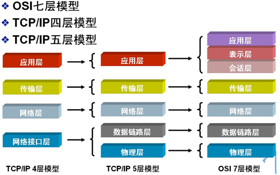
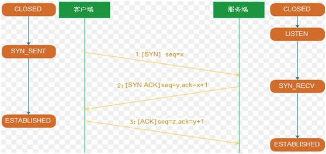
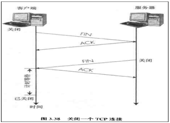
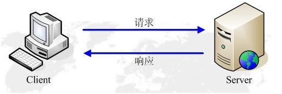
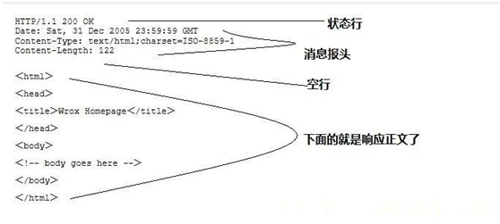
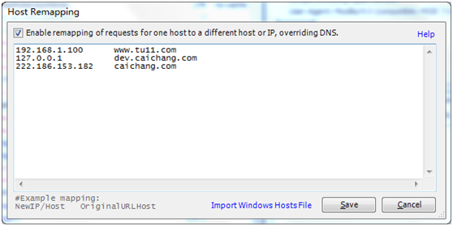
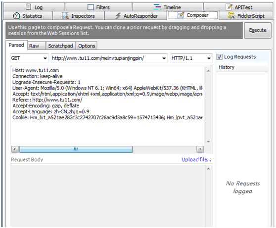
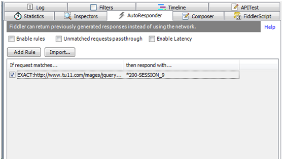
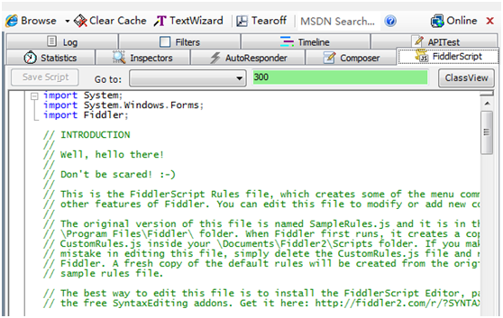

# 1.网络基础 

## 1.1 定义

计算机网络是用通信设备和线路将分散在不同地点的有独立功能的多个计算机系统互相连接起来，并按照网络协议进行数据通信，实现资源共享的计算机集合。

 

## 1.2 协议（protocol）

为进行数据交换而建立的规则、标准或约定

 

## 1.3 网络分层

# 2.传输层

## 2.1 简介

- 传输层是整个网络体系结构中的关键层次之一
- 主要负责向两个主机中进程之间的通信提供服务
- 在终端用户之间提供透明的数据传输，向上层提供可靠的数据传输服务
- 传输层在给定的链路上通过流量控制、分段/重组和差错控制来保证数据传输的可靠性
- 一些协议是面向链接的，这就意味着传输层能保持对分段的跟踪，并且重传那些失败的分段

 

## 2.2 TCP

- TCP（TransmissioControl Protocol）：传输控制协议。 
- 基于连接的协议，也就是说，在正式收发数据前，必须和对方建立可靠的连接。
- 一个TCP连接必须要经过三次“对话”才能建立起来

### 2.2.1 三次握手

- 主机A向主机B发出连接请求数据包：“我想给你发数据，可以吗？”（第一次）
- 主机B向主机A发送同意连接和要求同步的数据包“可以，我也想给你发，可以吗？”（第二次）
- 主机A再发出一个数据包确认主机B的要求同步：“可以！”（第三次）
- 三次“对话”的目的是使数据包的发送和接收同步，经过三次“对话”之后，主机A才向主机B正式发送数据。

 

### 2.2.2 四次断开

- 客户端A发送一个FIN，用来关闭客户A到服务器B的数据传送
- 服务器B收到这个FIN，它发回一个ACK，确认序号为收到的序号加1和SYN一样 
- 服务器B关闭与客户端A的连接，发送一个FIN给客户端A
- 客户端A发回ACK报文确认，并将确认序号设置为收到序号加1

 

## 2.3 UDP

UDP（User Data Protocol）面向非连接的，和TCP相反

 

## 2.4 TCP和UDP的不同

| **类型**         | **TCP**        | **UDP**    |
| ---------------- | -------------- | ---------- |
| 是否连接         | 面向连接       | 面向非连接 |
| 传输可靠性       | 可靠           | 不可靠     |
| 应用场合         | 传输大量数据   | 少量数据   |
| 速度             | 慢             | 快         |
| 对系统资源的要求 | 较多           | 少         |
| 结构             | 复杂           | 简单       |
| 数据正确性       | 保证数据正确性 | 可能丢包   |
| 数据顺序保证性   | 保证顺序       | 不保证顺序 |

# 3.应用层

## 3.1 简介

- 应用层也称为应用实体。

- 由若干个特定应用服务元素和一个或多个公用应用服务元素组成

- 特定应用服务元素：提供特定的应用服务。

  例如：

  文件运输访问和管理（FTAM）、电子文电处理（MHS）、虚拟终端协议（VAP）等

- 公用应用服务元素：提供一组公用的应用服务。

  例如：

  联系控制服务元素（ACSE）、可靠运输服务元素（RTSE）和远程操作服务元素（ROSE）等。

 

## 3.2 常见协议

DNS、FTP、telnet、HTTP、SMTP等

## 3.3 HTTP（超级重点）

   

### 3.3.1 简介

http（超文本传输协议）是一个基于请求与响应模式的、无状态的

1990年提出，**目前使用HTTP/1.1**

 

主要特点：

1. 简单快速：客户向服务器请求服务时，只需传送请求方法和路径。请求方法常用的有GET、POST。

   每种方法规定了客户与服务器联系的类型不同。由于HTTP协议简单，使得HTTP服务器的程序规模小，因而通信速度很快。

2. 灵活：HTTP允许传输任意类型的数据对象。正在传输的类型由Content-Type加以标记。

3. 无连接：无连接的含义是限制每次连接只处理一个请求。

   服务器处理完客户的请求，并收到客户的应答后，即断开连接。采用这种方式可以节省传输时间。

4. 无状态：HTTP协议是无状态协议。

   无状态是指协议对于事务处理没有记忆能力。缺少状态意味着如果后续处理需要前面的信息，则它必须重传，这样可能导致每次连接传送的数据量增大。另一方面，在服务器不需要先前信息时它的应答就较快。

 

### 3.3.2 请求流程

客户端请求----------服务器响应

 

### 3.3.3 url地址

示例：http://apis.juhe.cn:80/mobile/get?phone=13265586937&key=63a77489d

| **名称**          | **说明**                    |
| ----------------- | --------------------------- |
| http              | 协议类型                    |
| apis.juhe.c       | 域名                        |
| 80                | 端口                        |
| mobile/get        | 路径                        |
| ?                 | 参数分隔符                  |
| phone=13265586937 | 参数1                       |
| &                 | 参数连接符（多参之间&分隔） |
| key=63a77489d     | 参数2                       |

 

### 3.3.4 协议分析

#### 1、请求（request）

解释：客户端向服务器发出要请求的页面和数据

| **请求类型** | **说明**                                                     |
| ------------ | ------------------------------------------------------------ |
| **GET**      | 请求指定的页面信息，并返回实体主体，显式体现在URL上          |
| **POST**     | 请求可能会导致新的资源的建立和/或已有资源的修改，隐式体现在URL上 |
| HEAD         | 类似于get请求，但只返回的响应中没有具体的内容，用于获取报头  POST 向指定资源提交数据进行处理请求（例如提交表单或者上传文件）。数据被包含在请求体中 |
| PUT          | 从客户端向服务器传送的数据取代指定的文档的内容               |
| DELETE       | 请求服务器删除指定的页面                                     |
| CONNECT      | 请求以管道方式连接指定代理服务器                             |
| OPTIONS      | 允许客户端查看服务器的性能                                   |
| TRACE        | 回显服务器收到的请求，主要用于测试或诊断                     |

组成部分：4部分

​		请求行（request line）、**请求头部（header）**、空行、请求数据

常见信息头（header）：

- Accept：该请求报头域用于指定客户端接受哪些类型的信息。

- 例如： 

  （1）Accept：image/gif-----表明客户端希望接受GIF图象格式的资源；

  （2）Accept：text/html-----表明客户端希望接受html文本

  （3）Accept-Charset-----该请求报头域用于指定客户端接受的字符集

  （4）Accept-Encoding-----该请求报头域类似于Accept，但是它是用于指定可接受的内容编码。

  （5）Accept-Language-----该请求报头域类似于Accept，但是它是用于指定一种自然语言。

  （6）Authorization-----该请求报头域主要用于证明客户端有权查看某个资源。当浏览器访问一个页面时，如果收到服务器的响应代码为401（未授权），可以发送一个包含Authorization请求报头域的请求，要求服务器对其进行验证

- Host：该请求报头域主要用于指定被请求资源的Internet主机和端口号，它通常从HTTP URL中提取出来的

- User-Agent：该请求报头域允许客户端将它的操作系统、浏览器和其它属性告诉服务器。不过，这个报头不是必需的，如果我们自己编写一个浏览器，不使用User-Agent请求报头域，那么服务器端就无法得知我们的信息了。

#### 2、响应（response）

解释：服务器接收并处理客户端发过来的请求，该请求完成后会返回一个HTTP的响应消息

组成部分-----4部分

**状态行**、**消息报头（repsonse header）**、空行和响应正文

 

状态码-----有三位数字组成，第一个数字定义了响应的类别，共分五种类别: 

- 1xx：指示信息--表示请求已接收，继续处理
- 2xx：成功--表示请求已被成功接收、理解、接受
- 3xx：重定向--要完成请求必须进行更进一步的操作
- 4xx：客户端错误--请求有语法错误或请求无法实现
- 5xx：服务器端错误--服务器未能实现合法的请求 

 

常见状态码：

- 200 OK：客户端请求成功
- 400 Bad Request：客户端请求有语法错误，不能被服务器所理解
- 401 Unauthorized：请求未经授权，必须和WWW-Authenticate报头域一起使用
- 403 Forbidden：服务器收到请求，但是拒绝提供服务
- 404 Not Found：请求资源不存在，eg：输入了错误的URL 
- 500 Internal Server Error：服务器发生不可预期的错误 
- 503 Server Unavailable：服务器当前不能处理客户端的请求，一段时间后可能恢复正常

 

常见响应头：

1. Location：该响应报头域用于重定向接受者到一个新的位置。常用在更换域名的时候
2. Server：该响应报头域包含了服务器用来处理请求的软件信息。与User-Agent请求报头域是相对应的。
3. WWW-Authenticate：该响应报头域必须被包含在401（未授权的）响应消息中，客户端收到401响应消息时候，一同发送Authorization报头域请求服务器对其进行验证时，服务端响应报头就包含该报头域。
4. Content-Encoding：被用作媒体类型的修饰符，它的值指示了已经被应用到实体正文的附加内容的编码，因而要获得Content-Type报头域中所引用的媒体类型，必须采用相应的解码机制。Content-Encoding这样用于记录文档的压缩方法-----eg：Content-Encoding：gzip 
5. Content-Language：描述了资源所用的自然语言。 
6. Content-Length：用于指明实体正文的长度，以字节方式存储的十进制数字来表示。
7. Content-Type：指明发送给接收者的实体正文的媒体类型 
8. Last-Modified：用于指示资源的最后修改日期和时间。 
9. Expires：Expires实体报头域给出响应过期的日期和时间。我们可以使用Expires实体报头域指定页面过期的时间

## 3.4 HTTPS

### 3.4.1 简介

- HTTPS （全称：Hyper Text Transfer Protocol over SecureSocket Layer）
- 以安全为目标的 HTTP 通道
- 在HTTP的基础上通过传输加密和身份认证保证了传输过程的安全性
- HTTPS 在HTTP 的基础下加入SSL 层
- 它被广泛用于万维网上安全敏感的通讯，例如交易支付等方面
- HTTPS 主要由两部分组成：HTTP + SSL / TLS；也就是在 HTTP 上又加了一层处理加密信息的模块。服务端和客户端的信息传输都会通过 TLS 进行加密，所以传输的数据都是加密后的数据。

 

# 4.常见网络测试命令

1. ping：

   用来测试网络之间是否能够连通以及网络之间的传输速度 

2. tracert：

   用来跟踪从本机到目的地址所经过的路由

3.  netstat：

   用来查看最近活动的网络（也就是你最近访问了那些网站）

4. ipconfig：

   是用来查看本机的ip地址（ipv4或ipv6），加上/all就是获取更详细的信息

 

# 5. 抓包工具Fiddler（重点）

## 5.1 工具栏

注释（M）、Replay（R）、X（清空）、GO（debug）、切换流模式、解压请求（帮助把http里面压缩的内容解压出来）、保持多少会话数（必填太大，占内存）、仅捕获哪些进程发出的请求（仅捕获chrome）、查找、保存、保存截图、计时器、快速启动浏览器、清除缓存、编码/解码文本内容、分离面板、MSDN搜索（因为是.net开发）

 

## 5.2 控制台

help、capituring（让fiddler是否工作）、过滤会话来源、会话数记录、URL地址

## 5.3 监控面板

左侧（会话）

statistics

​		RTT：往返时间

inspectors（巡视包）

必会技能

autorepondor（自动应答）

把本地文件传给服务器，定位线上bug，必会技能

composer（前后端联合调试）

log（日志）

timeline（要整体选中某次请求看性能）

filter（过滤器）

右上（request）

右下（response）

## 5.4 开发环境host配置

## 5.5 前后端接口调试-----composer

## 5.6 线上bugfix

 

## 5.7 网络限速

 